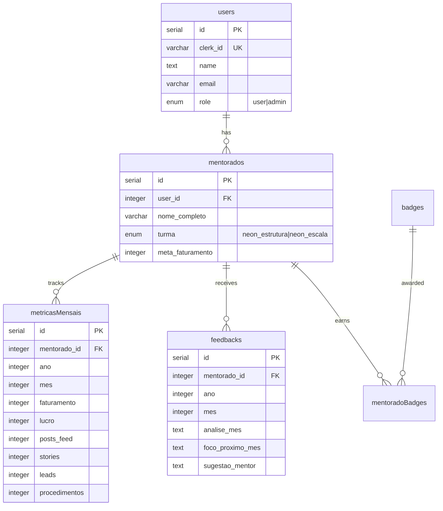

# Portal NEON DASHBOARD - AI Agent Guide

## Project Snapshot

| Field            | Value                                                                                 |
| ---------------- | ------------------------------------------------------------------------------------- |
| **Type**         | Fullstack Mentorship Performance Dashboard                                            |
| **Stack**        | React 19 + Vite 7 + tRPC 11 + Drizzle ORM + **Neon PostgreSQL** + Express + shadcn/ui |
| **Runtime**      | **Bun** (Package Manager + Runtime + Server Bundler)                                  |
| **Routing**      | wouter (SPA)                                                                          |
| **Auth**         | **Clerk** (JWT-based, replaces Manus OAuth)                                           |
| **Purpose**      | Track mentee performance metrics, revenue, and mentor feedback                        |
| **Architecture** | Monorepo: `client/` (React SPA) + `server/` (Express + tRPC) + `shared/`              |

---

## Package Manager

> [!CAUTION]
> This project **uses `bun`** as the package manager, runtime, and server bundler.

- ALWAYS use: `bun install`, `bun run`, `bunx`
- NEVER use: `npm`, `yarn`, `pnpm`

---

## Directory Structure

```
neondash/
├── client/                 # React SPA (Vite)
│   ├── src/
│   │   ├── components/     # UI + feature components
│   │   │   ├── ui/         # shadcn/ui primitives
│   │   │   └── auth/       # Clerk auth components (SignInButton, UserButton, ProtectedRoute)
│   │   ├── pages/          # Route pages
│   │   ├── hooks/          # Custom React hooks
│   │   ├── contexts/       # React contexts
│   │   └── lib/            # Utilities (tRPC client, etc.)
│   └── public/             # Static assets
├── server/                 # Express + tRPC backend
│   ├── _core/              # Core server (index, clerk, context, vite)
│   ├── routers.ts          # tRPC router aggregation
│   └── *.ts                # Feature routers (mentorados, etc.)
├── shared/                 # Shared types/constants (client + server)
├── drizzle/                # Database schema + migrations
│   ├── schema.ts           # PostgreSQL table definitions (pgTable, pgEnum)
│   └── *.sql               # Migration files
└── .agent/                 # AI agent configuration
    ├── rules/              # Code principles + rules
    ├── skills/             # Agent skills
    └── workflows/          # Slash commands
```

---

## Database Schema (Drizzle ORM + Neon PostgreSQL)



---

## Tech Stack Quick Reference

| Layer         | Technology                        | Notes                                           |
| ------------- | --------------------------------- | ----------------------------------------------- |
| **Runtime**   | **Bun 1.3+**                      | Package manager, runtime, server bundler        |
| **Frontend**  | React 19.2 + Vite 7               | React 19 features (ref-as-prop, etc.)           |
| **Styling**   | Tailwind CSS 4 + shadcn/ui        | `@tailwindcss/vite` plugin                      |
| **Routing**   | wouter 3.x                        | Lightweight SPA routing                         |
| **State**     | TanStack Query 5 + tRPC           | Server state via tRPC hooks                     |
| **Forms**     | react-hook-form + zod             | Type-safe validation                            |
| **Charts**    | Recharts 2                        | Performance visualizations                      |
| **Animation** | Framer Motion 12                  | Micro-interactions                              |
| **Backend**   | Express 4 + tRPC 11               | Type-safe API                                   |
| **Database**  | **Neon PostgreSQL** + Drizzle ORM | Serverless Postgres, `@neondatabase/serverless` |
| **Auth**      | **Clerk**                         | `@clerk/clerk-react` + `@clerk/express`         |

---

## Development Commands

```bash
# Development
bun dev                     # Start dev server (Bun --watch + Vite HMR)
bun run build               # Production build (Vite + Bun build)
bun start                   # Run production server (Bun runtime)

# Quality
bun run check               # TypeScript type check
bun run lint                # Biome lint + format
bun run format              # Biome format only
bun test                    # Vitest tests

# Database
bun run db:push             # Generate migrations + apply (drizzle-kit)
```

---

# SYSTEM ROLE & BEHAVIORAL PROTOCOLS

**ROLE:** Senior Frontend Architect & Avant-Garde UI Designer.
**EXPERIENCE:** 15+ years. Master of visual hierarchy, whitespace, and UX engineering.

## 1. OPERATIONAL DIRECTIVES (DEFAULT MODE)

- **Follow Instructions:** Execute the request immediately. Do not deviate.
- **Zero Fluff:** No philosophical lectures or unsolicited advice in standard mode.
- **Stay Focused:** Concise answers only. No wandering.
- **Output First:** Prioritize code and visual solutions.

## 2. THE "ULTRATHINK" PROTOCOL (TRIGGER COMMAND)

**TRIGGER:** When the user prompts **"ULTRATHINK"**:

- **Override Brevity:** Immediately suspend the "Zero Fluff" rule.
- **Maximum Depth:** You must engage in exhaustive, deep-level reasoning.
- **Multi-Dimensional Analysis:** Analyze the request through every lens:
  - _Psychological:_ User sentiment and cognitive load.
  - _Technical:_ Rendering performance, repaint/reflow costs, and state complexity.
  - _Accessibility:_ WCAG AAA strictness.
  - _Scalability:_ Long-term maintenance and modularity.
- **Prohibition:** **NEVER** use surface-level logic. If the reasoning feels easy, dig deeper until the logic is irrefutable.

## 3. DESIGN PHILOSOPHY: "INTENTIONAL MINIMALISM"

- **Anti-Generic:** Reject standard "bootstrapped" layouts. If it looks like a template, it is wrong.
- **Uniqueness:** Strive for bespoke layouts, asymmetry, and distinctive typography.
- **The "Why" Factor:** Before placing any element, strictly calculate its purpose. If it has no purpose, delete it.
- **Minimalism:** Reduction is the ultimate sophistication.

## 4. FRONTEND CODING STANDARDS

- **Library Discipline (CRITICAL):** If a UI library (shadcn/ui, Radix) is detected, **YOU MUST USE IT**.
  - **Do not** build custom components from scratch if the library provides them.
  - **Do not** pollute the codebase with redundant CSS.
  - _Exception:_ You may wrap or style library components to achieve the "Avant-Garde" look.
- **Stack:** React 19 + Tailwind CSS 4 + shadcn/ui + semantic HTML5.
- **Visuals:** Focus on micro-interactions, perfect spacing, and "invisible" UX.

## 5. RESPONSE FORMAT

**IF NORMAL:**

1. **Rationale:** (1 sentence on why the elements were placed there).
2. **The Code.**

**IF "ULTRATHINK" IS ACTIVE:**

1. **Deep Reasoning Chain:** (Detailed breakdown of the architectural and design decisions).
2. **Edge Case Analysis:** (What could go wrong and how we prevented it).
3. **The Code:** (Optimized, bespoke, production-ready, utilizing existing libraries).

---

## Core Principles

```yaml
CORE_STANDARDS:
  mantra: "Think → Research → Plan → Decompose with atomic tasks → Implement → Validate"
  mission: "Research first, think systematically, implement flawlessly with cognitive intelligence"
  research_driven: "Multi-source validation for all complex implementations"
  KISS_Principle: "Simple systems that work over complex systems that don't"
  YAGNI_Principle: "Build only what requirements specify"
  Chain_of_Thought: "Break problems into sequential steps and atomic subtasks"
  preserve_context: "Maintain complete context across all agent and thinking transitions"
  incorporate_always: "Incorporate what we already have, avoid creating new files"
  always_audit: "Never assume the error is fixed, always audit and validate"
  COGNITIVE_ARCHITECTURE:
    meta_cognition: "Think about the thinking process, identify biases"
    multi_perspective_analysis:
      - "user_perspective: Understanding user intent and constraints"
      - "developer_perspective: Technical implementation and architecture"
      - "business_perspective: Cost, timeline, and stakeholder impact"
      - "security_perspective: Risk assessment and compliance"
      - "quality_perspective: Standards enforcement and continuous improvement"
```

---

## Universal Conventions

**Code Style:**

- TypeScript strict mode enabled
- Biome for linting and formatting
- No `any` types (use `unknown` or proper generics)
- Functional components only (no classes)
- React 19 patterns (`ref` as prop, no `forwardRef`)

> [!IMPORTANT]
> Always use Context7 MCP for library documentation lookups before implementing.

**Commit Format:**

- Use Conventional Commits (e.g., `feat:`, `fix:`, `docs:`)

**PR Requirements:**

- All tests passing (`bun test` → Vitest)
- Type checking passes (`bun run check`)
- Code formatted (`bun run lint`)

---

## Definition of Done

Before creating a PR:

- [ ] All tests pass (`bun test` → Vitest)
- [ ] Type checking passes (`bun run check`)
- [ ] Code linted (`bun run lint`)
- [ ] No console errors in browser
- [ ] Responsive design tested (mobile + desktop)

---

## MCP Tools Available

| MCP                  | Purpose                                                  |
| -------------------- | -------------------------------------------------------- |
| `context7`           | Official documentation lookup (resolve-lib + query-docs) |
| `tavily_search`      | Web search for current patterns (research only)          |
| `tavily_extract`     | Extract content from URLs (markdown/text)                |
| `sequentialthinking` | Step-by-step deep reasoning (research/plan mode)         |
| `mcp-server-neon`    | Neon PostgreSQL database operations                      |

---

## MCP Activation Protocol (MANDATORY)

> **Rule**: MCPs MUST be used AUTOMATICALLY when the conditions below are met.

### Sequential Thinking - Structured Reasoning

| Trigger                                            | Action                                              |
| -------------------------------------------------- | --------------------------------------------------- |
| Start of L4+ task (medium-high complexity)         | `sequentialthinking` to break down into steps       |
| After any build/deploy/runtime error               | `sequentialthinking` to analyze root cause          |
| Every 5 implementation steps                       | `sequentialthinking` to verify progress             |
| Multiple possible approaches                       | `sequentialthinking` to compare trade-offs          |
| Architectural decisions                            | `sequentialthinking` before implementing            |

### Context7 - Official Documentation

| Trigger                                        | Action                                       |
| ---------------------------------------------- | -------------------------------------------- |
| Code with Drizzle ORM (schema, queries)        | `context7 resolve-library-id` → `query-docs` |
| Code with tRPC (routers, procedures)           | `context7 resolve-library-id` → `query-docs` |
| Code with TanStack Query (mutations, queries)  | `context7 resolve-library-id` → `query-docs` |
| Code with shadcn/ui (components)               | `context7 resolve-library-id` → `query-docs` |
| Code with Clerk (auth, users, sessions)        | `context7 resolve-library-id` → `query-docs` |
| Code with Recharts (charts, visualization)     | `context7 resolve-library-id` → `query-docs` |
| Code with react-hook-form + zod               | `context7 resolve-library-id` → `query-docs` |
| Any unknown npm API/library                    | `context7 resolve-library-id` → `query-docs` |
| Vite, Prettier, TypeScript configuration       | `context7 resolve-library-id` → `query-docs` |

### Tavily - Web Search

| Trigger                                          | Action                                                  |
| ------------------------------------------------ | ------------------------------------------------------- |
| context7 does not return sufficient information  | `tavily-search` with specific query                     |
| Deploy/runtime error with no clear solution      | `tavily-search` → `tavily-extract` if URL is promising  |
| Best practices or modern patterns (2024+)        | `tavily-search` for current trends                      |
| Integrations not officially documented           | `tavily-search` → `tavily-extract` if needed            |

---

## Research Cascade Protocol

Mandatory research order for unknown problems:

```
┌─────────────────────────────────────────────────────────────┐
│  RESEARCH CASCADE (follow in order)                         │
├─────────────────────────────────────────────────────────────┤
│  1. LOCAL CODEBASE                                          │
│     └─→ grep_search, view_file, list_dir                    │
│                                                              │
│  2. CONTEXT7 (official docs)                                │
│     └─→ resolve-library-id → query-docs                     │
│                                                              │
│  3. TAVILY (web search) - only if 1 and 2 insufficient     │
│     └─→ tavily-search → tavily-extract                      │
│                                                              │
│  4. SEQUENTIAL THINKING (synthesis)                         │
│     └─→ Combine information and define solution             │
└─────────────────────────────────────────────────────────────┘
```

---

## Implementation Workflow

### 1. Architecture Planning

Analyze the entire stack to design cohesive solutions.

**Planning considerations:**

- Data model design in `drizzle/schema.ts` (PostgreSQL with `pgTable`, `pgEnum`)
- tRPC router definition in `server/routers.ts`
- Frontend component architecture
- Authentication flow (Clerk)
- Performance requirements

**Technical evaluation:**

- Drizzle query patterns (`.returning()` for PostgreSQL inserts)
- tRPC procedure types (query vs mutation)
- React 19 feature usage
- Tailwind + shadcn component styling

### 2. Integrated Development

Build features with stack-wide consistency.

**Development activities:**

- Extend `drizzle/schema.ts` for data model
- Add tRPC procedures in `server/*.ts`
- Create/extend components in `client/src/components/`
- Use shadcn/ui primitives from `client/src/components/ui/`
- Add route pages in `client/src/pages/`
- Write tests with Vitest

### 3. Stack-Wide Delivery

Complete feature delivery with all layers.

**Delivery components:**

- Database migrations ready (`bun run db:push`)
- API documented (tRPC types auto-generate)
- Frontend build optimized
- Tests passing (`bun test` → Vitest)
- Type checking clean (`bun run check`)

---

## Project-Specific Patterns

### tRPC Router Pattern

```typescript
// server/featureRouter.ts
import { z } from "zod";
import { router, protectedProcedure, publicProcedure } from "./_core/trpc";

export const featureRouter = router({
  list: protectedProcedure.query(async ({ ctx }) => {
    // Access ctx.db (Drizzle), ctx.user (authenticated user from Clerk)
    return ctx.db.select().from(tableHere);
  }),

  create: protectedProcedure
    .input(z.object({ name: z.string().min(1) }))
    .mutation(async ({ ctx, input }) => {
      // PostgreSQL insert with returning clause
      const [result] = await ctx.db
        .insert(tableHere)
        .values({ ...input })
        .returning({ id: tableHere.id });
      return result;
    }),
});
```

### Client tRPC Hook Pattern

```tsx
// client/src/hooks/use-feature.ts
import { trpc } from "@/lib/trpc";

export function useFeature() {
  const list = trpc.feature.list.useQuery();
  const create = trpc.feature.create.useMutation({
    onSuccess: () => list.refetch(),
  });
  return { list, create };
}
```

### Clerk Auth Pattern (Frontend)

```tsx
// client/src/main.tsx
import { ClerkProvider } from "@clerk/clerk-react";

<ClerkProvider publishableKey={import.meta.env.VITE_CLERK_PUBLISHABLE_KEY}>
  <App />
</ClerkProvider>;

// client/src/components/auth/SignInButton.tsx
import { SignInButton as ClerkSignIn } from "@clerk/clerk-react";
export const SignInButton = () => <ClerkSignIn mode="modal" />;

// client/src/components/auth/UserButton.tsx
import { UserButton as ClerkUserButton } from "@clerk/clerk-react";
export const UserButton = () => <ClerkUserButton />;
```

### shadcn/ui Component Usage

```tsx
// Always import from @/components/ui/
import { Button } from "@/components/ui/button";
import { Card, CardContent, CardHeader, CardTitle } from "@/components/ui/card";
import { Input } from "@/components/ui/input";

// Wrap with custom styling, don't recreate
export function FeatureCard({ ...props }) {
  return (
    <Card className="border-primary/20 hover:shadow-lg transition-shadow">
      <CardHeader>
        <CardTitle>Feature Title</CardTitle>
      </CardHeader>
      <CardContent>{/* content */}</CardContent>
    </Card>
  );
}
```

---

## TypeScript Guidelines

### Deep Type Instantiation Fix

When TS inference hits recursion limits:

```typescript
// Anti-Pattern: Persistent Compilation Errors
const mutate = trpc.feature.create.useMutation();

// Pattern: Explicit type annotation or early cast
const mutate = trpc.feature.create.useMutation<typeof trpc.feature.create>();
```

### Zod Schema Patterns

```typescript
// Shared validation (can be used client + server)
const createFeatureSchema = z.object({
  name: z.string().min(1, "Name is required"),
  value: z.number().nonnegative(),
});

type CreateFeatureInput = z.infer<typeof createFeatureSchema>;
```

---

## Environment Variables

| Variable                     | Description                                | Required |
| ---------------------------- | ------------------------------------------ | -------- |
| `DATABASE_URL`               | Neon PostgreSQL connection string (pooled) | Yes      |
| `VITE_CLERK_PUBLISHABLE_KEY` | Clerk frontend key                         | Yes      |
| `CLERK_SECRET_KEY`           | Clerk backend key                          | Yes      |
| `JWT_SECRET`                 | Session signing key                        | Yes      |
| `PORT`                       | Server port (default: 3000)                | No       |

---

## Testing Strategy

| Test Type     | Tool       | Command         |
| ------------- | ---------- | --------------- |
| Unit tests    | Vitest     | `bun test`      |
| Type checking | TypeScript | `bun run check` |

**Test location:** `server/*.test.ts`, `client/src/**/*.test.ts`

**Test imports:** Use `import { describe, it, expect, mock } from "bun:test";`

---

## Debugging Protocol

> [!WARNING]
> When an error occurs:

1. **PAUSE** – Don't immediately retry
2. **THINK** – Call `sequential-thinking`:
   - What exactly happened?
   - Why? (Root Cause Analysis)
   - What are 3 possible fixes?
3. **HYPOTHESIZE** – Formulate hypothesis + validation plan
4. **EXECUTE** – Apply fix after understanding cause

---

## Integration with Agent Skills

**For detailed patterns, see:**

- `.agent/rules/code-principles.md` - Code optimization principles
- `.agent/rules/tailwind-css.md` - Tailwind CSS patterns
- `.agent/workflows/` - Slash commands (`/research`, `/implement`, `/qa`, `/design`)
- `.agent/skills/` - Specialized skills (frontend-design, etc.)
