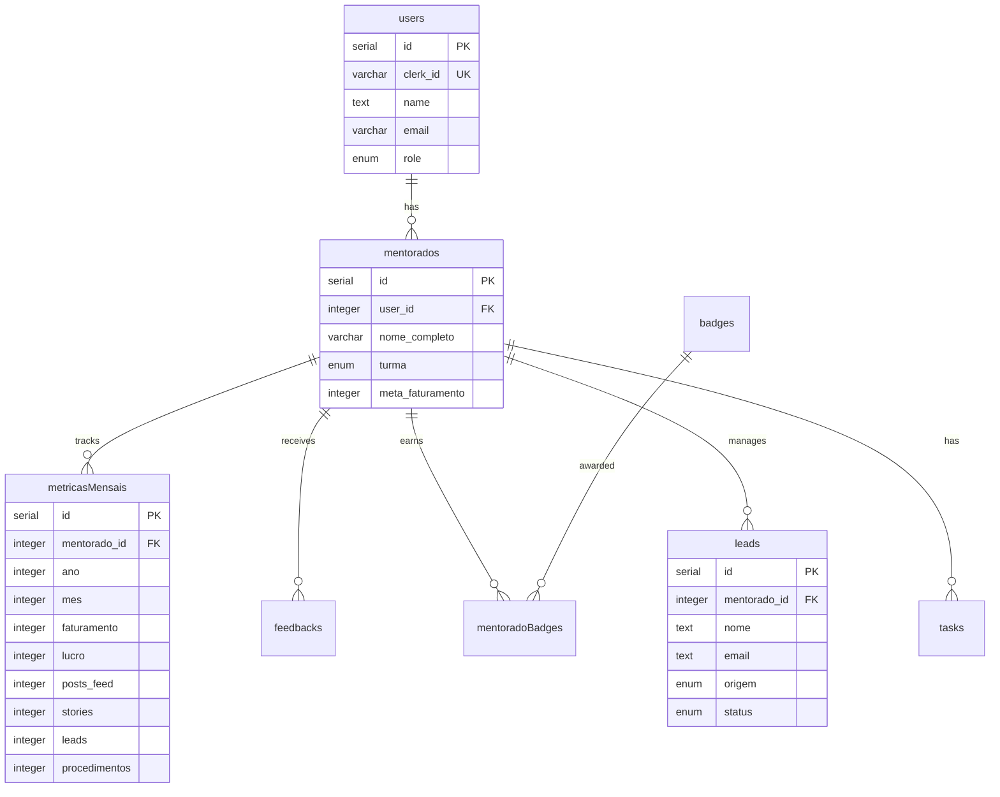

# 🚀 NEON Dashboard

<div align="center">


**Performance Dashboard for Mentorships** — Fullstack platform for metrics tracking, gamification, and mentee CRM.

[Demo](https://neondash.grupousclinicas.com.br) · [Documentation](#-documentation) · [Contributing](#-contributing)

</div>

---

## 📋 About

**NEON Dashboard** is a complete mentorship management platform focused on the aesthetics and health niche. It allows mentors to track the performance of their mentees through monthly metrics, gamification with badges, integrated CRM, and AI-powered analysis.

### ✨ Key Features

| Module | Description |
|--------|-------------|
| **📊 Dashboard** | Overview of revenue, profit, leads, and procedures |
| **📈 Monthly Metrics** | Recording and tracking of monthly KPIs |
| **🎮 Gamification** | Badge system, rankings, and streaks |
| **📱 CRM Kanban** | Lead management with visual pipeline |
| **🤖 Neon Coach** | AI assistant for task generation and insights |
| **🗺️ Neon Journey** | Activity roadmap and mentorship modules |
| **📅 Calendar** | Google Calendar integration |
| **💬 WhatsApp** | Z-API integration for communication |
| **📸 Instagram** | Automatic metrics sync (posts/stories) |

---

## 🛠️ Tech Stack

### Core
| Technology | Version | Usage |
|------------|---------|-------|
| **Bun** | 1.3+ | Runtime, package manager, bundler |
| **React** | 19.2 | Frontend SPA |
| **Vite** | 7.x | Build tool & HMR |
| **TypeScript** | 5.9 | Type safety |

### Backend
| Technology | Usage |
|------------|-------|
| **Express** | HTTP server |
| **tRPC** | Type-safe API |
| **Drizzle ORM** | Database queries |
| **Neon PostgreSQL** | Serverless database |
| **Clerk** | JWT Authentication |

### Frontend
| Technology | Usage |
|------------|-------|
| **Tailwind CSS 4** | Styling |
| **shadcn/ui** | Component library |
| **TanStack Query** | Server state |
| **wouter** | Client-side routing |
| **Recharts** | Data visualization |
| **Framer Motion** | Animations |

### Integrations
| Service | Usage |
|---------|-------|
| **Clerk** | Auth & User management |
| **Google APIs** | Calendar integration |
| **Z-API** | WhatsApp Business |
| **Instagram Graph API** | Social metrics |
| **Gemini AI** | Intelligent coach |

---

## 📁 Project Structure

```
neondash/
├── client/               # React SPA
│   └── src/
│       ├── components/   # UI + feature components
│       │   ├── ui/       # shadcn/ui primitives
│       │   ├── auth/     # Clerk auth components
│       │   └── dashboard/ # Dashboard widgets
│       ├── pages/        # Route pages
│       ├── hooks/        # Custom React hooks
│       ├── contexts/     # React contexts
│       └── lib/          # Utilities (tRPC client)
├── server/               # Express + tRPC backend
│   ├── _core/            # Core (index, context, vite, clerk)
│   └── routers/          # tRPC routers
├── shared/               # Shared types/constants
├── drizzle/              # Database schema + migrations
│   └── schema.ts         # PostgreSQL table definitions
├── docs/                 # Documentation
└── .agent/               # AI agent configuration
```

---

## 🗄️ Database Schema



---

## ⚡ Quick Start

### Prerequisites

- **Bun** 1.3+ ([install](https://bun.sh))
- **Neon** account for PostgreSQL
- **Clerk** account for authentication

### 1. Clone the repository

```bash
git clone https://github.com/GrupoUS/neondash.git
cd neondash
```

### 2. Install dependencies

```bash
bun install
```

### 3. Configure environment variables

```bash
cp .env.example .env
```

Edit `.env` with your credentials:

```env
# Database (Neon PostgreSQL)
DATABASE_URL="postgresql://..."

# Clerk Auth
VITE_CLERK_PUBLISHABLE_KEY="pk_..."
CLERK_SECRET_KEY="sk_..."

# JWT
JWT_SECRET="your-secret-key"

# Optional: AI
GEMINI_API_KEY="..."
```

### 4. Set up the database

```bash
bun run db:push
bun run db:seed
```

### 5. Start the development server

```bash
bun dev
```

Access: **http://localhost:3000**

---

## 📜 Available Scripts

| Command | Description |
|---------|-------------|
| `bun dev` | Start development server with HMR |
| `bun run build` | Production build (Vite + Bun) |
| `bun start` | Run production build |
| `bun run check` | Verify TypeScript types |
| `bun run lint` | Lint + format with Biome (auto-fix) |
| `bun run lint:check` | Check lint without auto-fix |
| `bun run test` | Run tests with Vitest |
| `bun run test:watch` | Tests in watch mode |
| `bun run db:push` | Apply migrations to the database |
| `bun run db:studio` | Open Drizzle Studio |
| `bun run db:seed` | Seed the database with initial data |

---

## 🔐 Authentication

The project uses **Clerk** for authentication. The flow includes:

1. **Frontend**: `@clerk/clerk-react` with `ClerkProvider`
2. **Backend**: `@clerk/express` with authentication middleware
3. **tRPC**: Context with `ctx.user` for protected procedures

```tsx
// Frontend - Auth components
import { SignInButton, UserButton } from "@clerk/clerk-react";

// Backend - Protected tRPC
const protectedProcedure = t.procedure.use(authMiddleware);
```

---

## 🧪 Code Quality

### Linting & Formatting

The project uses **Biome** for linting and formatting:

```bash
# Check
bun run lint:check

# Auto-fix
bun run lint
```

### TypeScript

Strict mode enabled. Verify types with:

```bash
bun run check
```

### Tests

Vitest for unit tests:

```bash
bun run test
bun run test:watch
bun run test:coverage
```

---

## 🚀 Deploy

### Production

```bash
# Build
bun run build

# Start
bun start
```

### Production Environment Variables

```env
NODE_ENV=production
DATABASE_URL="postgresql://..."
VITE_CLERK_PUBLISHABLE_KEY="pk_live_..."
CLERK_SECRET_KEY="sk_live_..."
JWT_SECRET="production-secret"
```

---

## 📖 Documentation

| Document | Description |
|----------|-------------|
| [GEMINI.md](./GEMINI.md) | Complete guide for AI agents |
| [AGENTS.md](./AGENTS.md) | Code rules and architecture |
| [docs/](./docs/) | Additional documentation |

---

## 🤝 Contributing

1. Fork the repository
2. Create your branch (`git checkout -b feature/amazing-feature`)
3. Commit your changes (`git commit -m 'feat: add amazing feature'`)
4. Push to the branch (`git push origin feature/amazing-feature`)
5. Open a Pull Request

### Commit Convention

We follow [Conventional Commits](https://www.conventionalcommits.org/):

- `feat:` New feature
- `fix:` Bug fix
- `docs:` Documentation
- `style:` Formatting
- `refactor:` Refactoring
- `test:` Tests
- `chore:` Maintenance

---

## 📄 License

This project is licensed under the MIT License. See the [LICENSE](./LICENSE) file for more details.

---

## 👥 Team

Developed by **Grupo US Clínicas** for the **Mentoria Black** program.

---

<div align="center">

**[⬆ Back to top](#-neon-dashboard)**

</div>
