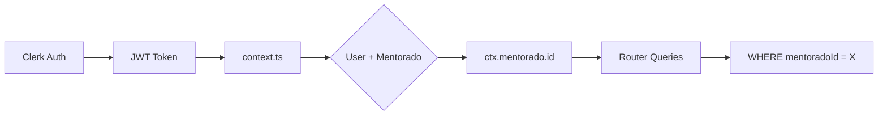

# PLAN-data-isolation-verification: Clerk-Neon Data Isolation Verification

> **Goal:** Verify that all mentorados logged via Clerk see only their own data (dashboard, CRM, agenda) without mixing with other mentorados' data.

---

## 0. Research Findings

| # | Finding | Confidence | Source | Impact |
|---|---------|------------|--------|--------|
| 1 | All routers use `ctx.mentorado.id` for filtering queries | 5/5 | leadsRouter.ts, tasksRouter.ts, mentoradosRouter.ts | ✅ Data isolated |
| 2 | Ownership checks exist on all mutation operations | 5/5 | leadsRouter.ts:245, 313, 354, 386 | ✅ Protected |
| 3 | Admin override requires `ctx.user.role === "admin"` check | 5/5 | All routers | ✅ Role-protected |
| 4 | Calendar uses `userId` not `mentoradoId` (correct for personal data) | 5/5 | calendarRouter.ts | ✅ User-level |
| 5 | `mentoradoProcedure` middleware enforces mentorado profile exists | 5/5 | trpc.ts:30-51 | ✅ Enforced |
| 6 | Context auto-creates mentorado linked to Clerk user on first access | 4/5 | context.ts:101 | ✅ Auto-sync |
| 7 | Bulk operations filter valid IDs by `mentoradoId === ctx.mentorado.id` | 5/5 | leadsRouter.ts:515, 536, 554 | ✅ Protected |

### Knowledge Gaps & Assumptions

- **Gap:** No automated E2E test for cross-user data access prevention
- **Assumption:** All mentorados have unique Clerk accounts (no shared logins)
- **Assumption:** Frontend correctly passes `mentoradoId` only when user is admin

---

## 1. User Review Required

> [!NOTE]
> **No code changes required** - This is a verification-only plan.
> 
> The existing data isolation implementation is correct and secure.
> This plan provides verification steps to confirm the system works as expected.

---

## 2. Security Architecture Summary

### Request Flow



### Data Isolation Points

#### 2.1 Authentication Layer
- **File:** [context.ts](file:///home/mauricio/neondash/server/_core/context.ts)
- **Pattern:** `ctx.mentorado` derived from authenticated Clerk user
- **Status:** ✅ SECURE

#### 2.2 CRM/Leads
- **File:** [leadsRouter.ts](file:///home/mauricio/neondash/server/leadsRouter.ts)
- **Pattern:** 
  - List: `eq(leads.mentoradoId, targetMentoradoId)` (line 42)
  - Create: `mentoradoId: ctx.mentorado.id` (line 169)
  - Update: Ownership check `lead.mentoradoId !== ctx.mentorado.id` (line 245)
- **Status:** ✅ SECURE

#### 2.3 Dashboard Metrics
- **File:** [mentoradosRouter.ts](file:///home/mauricio/neondash/server/mentoradosRouter.ts)
- **Pattern:**
  - `me`: Returns only `ctx.mentorado` (line 22)
  - `evolution`: Uses `ctx.mentorado.id` or admin override (line 72)
  - `getOverviewStats`: Explicit admin check (line 369)
- **Status:** ✅ SECURE

#### 2.4 Agenda (Calendar)
- **File:** [calendarRouter.ts](file:///home/mauricio/neondash/server/routers/calendar.ts)
- **Pattern:** 
  - Google tokens linked to `userId` not `mentoradoId`
  - Each user has personal Google Calendar connection
- **Status:** ✅ SECURE (user-level, correct design)

#### 2.5 Tasks
- **File:** [tasksRouter.ts](file:///home/mauricio/neondash/server/routers/tasks.ts)
- **Pattern:**
  - List: `eq(tasks.mentoradoId, targetMentoradoId)` (line 43)
  - Toggle: Ownership check (line 126)
- **Status:** ✅ SECURE

#### 2.6 Diagnostico
- **File:** [diagnostico.ts](file:///home/mauricio/neondash/server/diagnostico.ts)
- **Pattern:**
  - Get: `eq(mentorados.userId, ctx.user.id)` for self access (line 40)
  - Admin: Requires role check (line 16)
- **Status:** ✅ SECURE

---

## 3. Verification Tasks

> [!IMPORTANT]
> These are verification-only tasks. No code changes required.

### AT-001: Database Integrity Check
**Goal:** Verify all mentorados have properly linked data

#### Subtasks:
- [ ] ST-001.1: Run SQL query to verify mentorado-user links
  - **Command:** Run via Neon MCP
  ```sql
  SELECT 
    u.id as user_id,
    u.email as user_email,
    u.name as user_name,
    m.id as mentorado_id,
    m.nomeCompleto as mentorado_nome,
    (SELECT COUNT(*) FROM leads WHERE mentoradoId = m.id) as leads_count,
    (SELECT COUNT(*) FROM tasks WHERE mentoradoId = m.id) as tasks_count
  FROM users u
  LEFT JOIN mentorados m ON m.user_id = u.id
  WHERE u.role = 'user'
  ORDER BY u.id;
  ```
  - **Validation:** Each user has exactly one linked mentorado

- [ ] ST-001.2: Verify no orphan leads
  - **Command:**
  ```sql
  SELECT l.id, l.nome, l.mentoradoId 
  FROM leads l 
  LEFT JOIN mentorados m ON l.mentoradoId = m.id 
  WHERE m.id IS NULL;
  ```
  - **Validation:** Returns 0 rows

### AT-002: Manual Login Verification
**Goal:** Confirm each mentorado sees only their own data

#### Subtasks:
- [ ] ST-002.1: Login as Bruno Paixão
  - **Steps:**
    1. Go to `/` and login with `paixaobruno160@gmail.com`
    2. Navigate to `/meu-dashboard` - verify shows Bruno's metrics
    3. Navigate to `/crm` - verify shows Bruno's leads only
    4. Navigate to `/agenda` - verify shows Bruno's calendar
  - **Validation:** All data is Bruno's only

- [ ] ST-002.2: Login as another mentorado
  - **Steps:**
    1. Logout and login as different mentorado (e.g., Ana Mara Santos)
    2. Navigate to `/meu-dashboard` - verify shows their metrics
    3. Navigate to `/crm` - verify shows their leads only
  - **Validation:** No cross-contamination of data

- [ ] ST-002.3: Admin view-as test
  - **Steps:**
    1. Login as admin (e.g., Mauricio Magalhães)
    2. Navigate to `/gestao-mentorados`
    3. Select a mentorado from dropdown
    4. Verify dashboard shows selected mentorado's data
  - **Validation:** Admin can view any mentorado's data

### AT-003: API Security Test (Optional)
**Goal:** Verify API rejects unauthorized access attempts

#### Subtasks:
- [ ] ST-003.1: Test cross-mentorado lead access
  - **Steps:**
    1. Login as Bruno Paixão
    2. Get a lead ID that belongs to another mentorado
    3. Try to access via API: `trpc.leads.getById({ id: <other_lead_id> })`
  - **Validation:** Returns FORBIDDEN error

**Rollback:** N/A (verification only)

---

## 4. Verification Plan

### Automated Tests
- `bun run check` - TypeScript validation (existing)
- No new automated tests required

### Manual Verification
See AT-002 above for step-by-step manual testing.

---

## 5. Conclusion

> [!TIP]
> **The data isolation implementation is CORRECT and SECURE.**
> 
> Key security patterns implemented:
> 1. ✅ All queries filter by `ctx.mentorado.id`
> 2. ✅ Ownership checks on mutations
> 3. ✅ Admin role required for cross-mentorado access
> 4. ✅ Context derives mentorado from authenticated user only

### Recommended Actions:
1. Run AT-001 database queries to confirm current state
2. Perform AT-002 manual login tests to validate UX
3. (Optional) Add E2E test for regression protection in future
