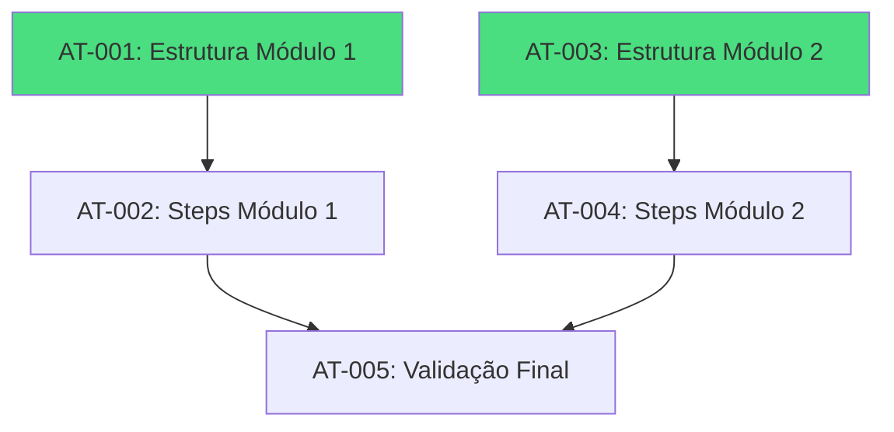

# PRP: Fase 3 - Estrutura de Dados (Módulos)

## Metadata

| Campo              | Valor                                                      |
| ------------------ | ---------------------------------------------------------- |
| **Complexity**     | L4 — Multi-file, data population, frontend rendering       |
| **Estimated Time** | 4-6 horas                                                  |
| **Parallel Safe**  | Sim (GPU-9/GPU-50 e GPU-10/GPU-51 podem rodar em paralelo) |
| **Risk Level**     | Baixo (sem migração de dados, apenas adição de conteúdo)   |
| **Issues**         | GPU-9, GPU-10, GPU-50, GPU-51                              |

---

## 1. Objetivo e Contexto

Popular o sistema de atividades com o conteúdo real dos programas Neon, estabelecendo a base para o acompanhamento de progresso do mentorado.

O arquivo `client/src/data/atividades-data.ts` atualmente contém:

- **Módulo 2**: Atividades Primordiais (checklist CNPJ, organização)
- **Atividades 01-12**: Posicionamento, Mindset, Planejamento, Vendas
- **Rotineiros + Estratégias**: Leitura, Conteúdo, Audiência, Follow-up

A tarefa é adicionar:

- **Módulo 1**: "Comece Aqui" - fundação da jornada (Neon Estrutura)
- **Módulo 2 Avançado**: Gestão, Processos, KPIs, Automação (Neon Escala)

---

## 2. Findings Table (APEX Research)

| #   | Finding                                                             | Confidence | Source                     | Impact |
| --- | ------------------------------------------------------------------- | ---------- | -------------------------- | ------ |
| 1   | Interface `Atividade` requer: codigo, titulo, etapa, icone, steps[] | 5/5        | atividades-data.ts:14-21   | High   |
| 2   | Interface `AtividadeStep` requer: codigo, label, descricao?         | 5/5        | atividades-data.ts:8-12    | High   |
| 3   | `AtividadesContent.tsx` usa `getAtividadesByEtapa()` para agrupar   | 5/5        | AtividadesContent.tsx:35   | Medium |
| 4   | Cada step deve ter `codigo` único no formato `{prefix}-{n}`         | 5/5        | atividades-data.ts:36-78   | High   |
| 5   | Progresso calculado via `calcularProgresso(progressMap)`            | 4/5        | atividades-data.ts:360-383 | Medium |
| 6   | Não existem testes unitários no projeto (apenas node_modules)       | 5/5        | find_by_name search        | Low    |
| 7   | Validação via `bun run check` (TypeScript) é padrão do projeto      | 5/5        | package.json:13            | High   |

---

## 3. Knowledge Gaps

| Gap                                       | Mitigation                                          |
| ----------------------------------------- | --------------------------------------------------- |
| Conteúdo exato do programa Neon Estrutura | Usuário deve fornecer lista de módulos/seções/steps |
| Conteúdo exato do programa Neon Escala    | Usuário deve fornecer lista de módulos/seções/steps |
| Ícones ideais para cada seção             | Usar emojis baseados no contexto semântico          |
| Ordem correta das atividades na jornada   | Assumir ordem sequencial; validar com usuário       |

---

## 4. Assumptions to Validate

1. **Módulo 1** é para iniciantes (fundação) e **Módulo 2** para escala (avançado)
2. Os `steps` podem ser marcados como concluídos independentemente da ordem
3. O campo `etapa` deve ser único por módulo ("Módulo 1", "Módulo 2")
4. Não há limite de `steps` por atividade
5. A estrutura existente de dados estáticos é suficiente (não precisa de banco)

---

## 5. Edge Cases

| #   | Edge Case                                        | Handling                                                  |
| --- | ------------------------------------------------ | --------------------------------------------------------- |
| 1   | Código duplicado entre atividades                | Usar prefixo único por atividade (ex: `m1-boas-1`)        |
| 2   | Accordion não expande com muitos itens           | Testar com 20+ steps; verificar scroll                    |
| 3   | Progresso não atualiza após adicionar novas ativ | Limpar cache ou recarregar; verificar `calcularProgresso` |
| 4   | TypeScript reclama de tipo ausente               | Garantir que todos campos obrigatórios estão presentes    |
| 5   | Renderização lenta com muitas atividades         | Usar virtualização se necessário (fora do escopo)         |

---

## 6. Tarefas Atômicas

### ⚡ Parallel Track A: GPU-9 + GPU-50 (Módulo 1)

#### AT-001: Criar Estrutura do Módulo 1

**Dependências:** Nenhuma
**Parallel Safe:** Sim

**Arquivo:** `client/src/data/atividades-data.ts`

**Ação:** Adicionar novo bloco de atividades para "Módulo 1" no array `ATIVIDADES`.

**Estrutura proposta:**

```typescript
// ═══════════════════════════════════════════════════════════════════════════
// MÓDULO 1 - COMECE AQUI (NEON ESTRUTURA)
// ═══════════════════════════════════════════════════════════════════════════
{
  codigo: "m1-boas-vindas",
  titulo: "Boas-Vindas à Jornada NEON",
  etapa: "Módulo 1",
  icone: "👋",
  descricao: "Seu primeiro passo na metodologia NEON.",
  steps: [
    { codigo: "m1-bv-1", label: "Assistir vídeo de boas-vindas" },
    { codigo: "m1-bv-2", label: "Ler guia de navegação da plataforma" },
    { codigo: "m1-bv-3", label: "Configurar foto de perfil" },
  ],
},
// ... demais seções
```

**Seções a incluir (baseado no plano original):**

1. Boas-vindas (vídeo, guia)
2. Diagnóstico (formulário, faturamento atual)
3. Jurídico (CNPJ, alvará)
4. Financeiro (contas, fluxo)
5. Precificação

**Validação:**

```bash
bun run check
# Deve passar sem erros
```

**Rollback:**

```bash
git checkout client/src/data/atividades-data.ts
```

---

#### AT-002: Popular Steps Detalhados do Módulo 1

**Dependências:** `[AT-001]`
**Parallel Safe:** Não

**Ação:** Expandir cada seção do Módulo 1 com steps específicos conforme documentação do Neon Estrutura.

> [!IMPORTANT]
> O conteúdo exato dos steps deve ser fornecido pelo usuário ou extraído da documentação do programa Neon Estrutura.

**Exemplo de expansão para seção Diagnóstico:**

```typescript
{
  codigo: "m1-diagnostico",
  titulo: "Diagnóstico do Negócio",
  etapa: "Módulo 1",
  icone: "📊",
  descricao: "Entenda sua situação atual para traçar o caminho.",
  steps: [
    { codigo: "m1-diag-1", label: "Preencher formulário de diagnóstico" },
    { codigo: "m1-diag-2", label: "Calcular faturamento dos últimos 3 meses" },
    { codigo: "m1-diag-3", label: "Identificar principais despesas fixas" },
    { codigo: "m1-diag-4", label: "Definir margem de lucro atual" },
    { codigo: "m1-diag-5", label: "Mapear pontos de melhoria identificados" },
  ],
},
```

**Validação:**

```bash
bun run check
bun dev # Verificar renderização visual
```

---

### ⚡ Parallel Track B: GPU-10 + GPU-51 (Módulo 2 Avançado)

#### AT-003: Criar Estrutura do Módulo 2 Avançado

**Dependências:** Nenhuma
**Parallel Safe:** Sim (paralelo com AT-001)

**Arquivo:** `client/src/data/atividades-data.ts`

**Ação:** Adicionar seções avançadas ao "Módulo 2" para o programa Neon Escala.

**Seções a incluir:**

1. Gestão de Equipe (mapeamento, recrutamento)
2. Processos/SOPs (documentação)
3. KPIs (faturamento, marketing)
4. Automação (agendamento, CRM)
5. Financeiro Avançado (DRE, fluxo)

**Estrutura proposta:**

```typescript
{
  codigo: "m2-gestao-equipe",
  titulo: "Gestão de Equipe",
  etapa: "Módulo 2",
  icone: "👥",
  descricao: "Construa e gerencie sua equipe de alta performance.",
  steps: [
    { codigo: "m2-eq-1", label: "Mapear cargos necessários" },
    { codigo: "m2-eq-2", label: "Criar descritivo de funções" },
    { codigo: "m2-eq-3", label: "Definir processo seletivo" },
    { codigo: "m2-eq-4", label: "Estruturar onboarding de colaboradores" },
  ],
},
```

**Validação:**

```bash
bun run check
```

---

#### AT-004: Popular Steps Detalhados do Módulo 2

**Dependências:** `[AT-003]`
**Parallel Safe:** Não

**Ação:** Expandir cada seção com steps específicos do Neon Escala.

> [!IMPORTANT]
> O conteúdo exato deve ser fornecido pelo usuário ou extraído da documentação do Neon Escala.

---

### Sequential: Validação Final

#### AT-005: Validação Visual e Funcional

**Dependências:** `[AT-002, AT-004]`
**Parallel Safe:** Não

**Ação:** Verificar que todas as novas atividades renderizam corretamente.

**Checklist:**

1. Executar `bun dev`
2. Navegar para Dashboard → Atividades
3. Verificar que Módulo 1 aparece expandível
4. Verificar que Módulo 2 (avançado) aparece
5. Marcar alguns steps como concluídos
6. Verificar que progresso geral atualiza

**Validação:**

```bash
bun run check  # TypeScript
bun run format # Prettier
```

---

## 7. Verification Plan

### Automated Checks

| Check      | Command          | Expected Result        |
| ---------- | ---------------- | ---------------------- |
| TypeScript | `bun run check`  | Exit code 0, no errors |
| Format     | `bun run format` | All files formatted    |
| Build      | `bun run build`  | Build succeeds         |

### Manual Verification

1. **Navegação para Atividades:**
   - Abrir `http://localhost:5000`
   - Fazer login
   - Clicar em "Atividades" no dashboard
   - Verificar que accordion expande corretamente

2. **Marcar Step como Concluído:**
   - Clicar em um checkbox de step
   - Verificar que o estado persiste (se implementado)
   - Verificar que barra de progresso atualiza

3. **Responsividade:**
   - Testar em viewport mobile (375px)
   - Verificar que texto não quebra layout

---

## 8. Dependencies



---

## 9. User Review Required

> [!WARNING]
> **Conteúdo Necessário:** Antes de implementar, o usuário deve fornecer:
>
> 1. Lista completa de seções/atividades do programa **Neon Estrutura** (Módulo 1)
> 2. Lista completa de seções/atividades do programa **Neon Escala** (Módulo 2)
> 3. Ordem correta das atividades na jornada do mentorado
> 4. Qualquer link/vídeo/recurso associado a cada step

Sem este conteúdo, serão usados placeholders baseados nas descrições existentes no plano original.

---

## 10. Next Steps

Após revisão e aprovação:

```bash
# Execute /implement para iniciar a implementação
```

---

## Pre-Submission Checklist

- [x] Codebase patterns searched and documented
- [x] Existing data structure analyzed (atividades-data.ts)
- [x] Component rendering verified (AtividadesContent.tsx)
- [x] Findings Table with confidence scores
- [x] Knowledge Gaps explicitly listed
- [x] Assumptions to Validate listed
- [x] Edge cases documented (5)
- [x] Atomic tasks defined
- [x] Validation commands specified
- [x] Dependencies mapped
- [x] Parallel-safe tasks marked
