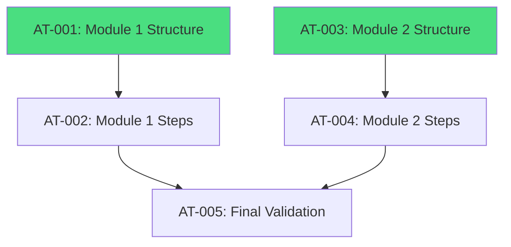

# PRP: Phase 3 - Data Structure (Modules)

## Metadata

| Field              | Value                                                      |
| ------------------ | ---------------------------------------------------------- |
| **Complexity**     | L4 — Multi-file, data population, frontend rendering       |
| **Estimated Time** | 4-6 hours                                                  |
| **Parallel Safe**  | Yes (GPU-9/GPU-50 and GPU-10/GPU-51 can run in parallel)   |
| **Risk Level**     | Low (no data migration, content addition only)             |
| **Issues**         | GPU-9, GPU-10, GPU-50, GPU-51                              |

---

## 1. Objective and Context

Populate the activities system with the actual content from the Neon programs, establishing the foundation for mentee progress tracking.

The file `client/src/data/atividades-data.ts` currently contains:

- **Module 2**: Primordial Activities (CNPJ checklist, organization)
- **Activities 01-12**: Positioning, Mindset, Planning, Sales
- **Routine + Strategies**: Reading, Content, Audience, Follow-up

The task is to add:

- **Module 1**: "Start Here" - journey foundation (Neon Estrutura)
- **Module 2 Advanced**: Management, Processes, KPIs, Automation (Neon Escala)

---

## 2. Findings Table (APEX Research)

| #   | Finding                                                             | Confidence | Source                     | Impact |
| --- | ------------------------------------------------------------------- | ---------- | -------------------------- | ------ |
| 1   | Interface `Atividade` requires: codigo, titulo, etapa, icone, steps[] | 5/5        | atividades-data.ts:14-21   | High   |
| 2   | Interface `AtividadeStep` requires: codigo, label, descricao?       | 5/5        | atividades-data.ts:8-12    | High   |
| 3   | `AtividadesContent.tsx` uses `getAtividadesByEtapa()` to group      | 5/5        | AtividadesContent.tsx:35   | Medium |
| 4   | Each step must have a unique `codigo` in the format `{prefix}-{n}`  | 5/5        | atividades-data.ts:36-78   | High   |
| 5   | Progress calculated via `calcularProgresso(progressMap)`            | 4/5        | atividades-data.ts:360-383 | Medium |
| 6   | No unit tests exist in the project (only node_modules)              | 5/5        | find_by_name search        | Low    |
| 7   | Validation via `bun run check` (TypeScript) is the project standard | 5/5        | package.json:13            | High   |

---

## 3. Knowledge Gaps

| Gap                                          | Mitigation                                             |
| -------------------------------------------- | ------------------------------------------------------ |
| Exact content of the Neon Estrutura program  | User must provide list of modules/sections/steps       |
| Exact content of the Neon Escala program     | User must provide list of modules/sections/steps       |
| Ideal icons for each section                 | Use emojis based on semantic context                   |
| Correct order of activities in the journey   | Assume sequential order; validate with user            |

---

## 4. Assumptions to Validate

1. **Module 1** is for beginners (foundation) and **Module 2** is for scaling (advanced)
2. Steps can be marked as completed regardless of order
3. The `etapa` field must be unique per module ("Module 1", "Module 2")
4. There is no limit on steps per activity
5. The existing static data structure is sufficient (no database needed)

---

## 5. Edge Cases

| #   | Edge Case                                        | Handling                                                     |
| --- | ------------------------------------------------ | ------------------------------------------------------------ |
| 1   | Duplicate code between activities                | Use unique prefix per activity (e.g., `m1-boas-1`)          |
| 2   | Accordion does not expand with many items        | Test with 20+ steps; verify scroll                           |
| 3   | Progress does not update after adding new activities | Clear cache or reload; verify `calcularProgresso`        |
| 4   | TypeScript complains about missing type          | Ensure all required fields are present                       |
| 5   | Slow rendering with many activities              | Use virtualization if needed (out of scope)                  |

---

## 6. Atomic Tasks

### Parallel Track A: GPU-9 + GPU-50 (Module 1)

#### AT-001: Create Module 1 Structure

**Dependencies:** None
**Parallel Safe:** Yes

**File:** `client/src/data/atividades-data.ts`

**Action:** Add a new activity block for "Module 1" in the `ATIVIDADES` array.

**Proposed structure:**

```typescript
// ═══════════════════════════════════════════════════════════════════════════
// MODULE 1 - START HERE (NEON ESTRUTURA)
// ═══════════════════════════════════════════════════════════════════════════
{
  codigo: "m1-boas-vindas",
  titulo: "Welcome to the NEON Journey",
  etapa: "Module 1",
  icone: "👋",
  descricao: "Your first step in the NEON methodology.",
  steps: [
    { codigo: "m1-bv-1", label: "Watch the welcome video" },
    { codigo: "m1-bv-2", label: "Read the platform navigation guide" },
    { codigo: "m1-bv-3", label: "Set up profile picture" },
  ],
},
// ... remaining sections
```

**Sections to include (based on the original plan):**

1. Welcome (video, guide)
2. Diagnostic (form, current revenue)
3. Legal (CNPJ, business license)
4. Financial (accounts, cash flow)
5. Pricing

**Validation:**

```bash
bun run check
# Should pass without errors
```

**Rollback:**

```bash
git checkout client/src/data/atividades-data.ts
```

---

#### AT-002: Populate Detailed Steps for Module 1

**Dependencies:** `[AT-001]`
**Parallel Safe:** No

**Action:** Expand each section of Module 1 with specific steps according to the Neon Estrutura documentation.

> [!IMPORTANT]
> The exact step content must be provided by the user or extracted from the Neon Estrutura program documentation.

**Example expansion for the Diagnostic section:**

```typescript
{
  codigo: "m1-diagnostico",
  titulo: "Business Diagnostic",
  etapa: "Module 1",
  icone: "📊",
  descricao: "Understand your current situation to chart the path forward.",
  steps: [
    { codigo: "m1-diag-1", label: "Fill in the diagnostic form" },
    { codigo: "m1-diag-2", label: "Calculate revenue for the last 3 months" },
    { codigo: "m1-diag-3", label: "Identify main fixed expenses" },
    { codigo: "m1-diag-4", label: "Define current profit margin" },
    { codigo: "m1-diag-5", label: "Map identified improvement areas" },
  ],
},
```

**Validation:**

```bash
bun run check
bun dev # Verify visual rendering
```

---

### Parallel Track B: GPU-10 + GPU-51 (Advanced Module 2)

#### AT-003: Create Advanced Module 2 Structure

**Dependencies:** None
**Parallel Safe:** Yes (parallel with AT-001)

**File:** `client/src/data/atividades-data.ts`

**Action:** Add advanced sections to "Module 2" for the Neon Escala program.

**Sections to include:**

1. Team Management (mapping, recruitment)
2. Processes/SOPs (documentation)
3. KPIs (revenue, marketing)
4. Automation (scheduling, CRM)
5. Advanced Financial (P&L, cash flow)

**Proposed structure:**

```typescript
{
  codigo: "m2-gestao-equipe",
  titulo: "Team Management",
  etapa: "Module 2",
  icone: "👥",
  descricao: "Build and manage your high-performance team.",
  steps: [
    { codigo: "m2-eq-1", label: "Map required positions" },
    { codigo: "m2-eq-2", label: "Create job descriptions" },
    { codigo: "m2-eq-3", label: "Define hiring process" },
    { codigo: "m2-eq-4", label: "Structure employee onboarding" },
  ],
},
```

**Validation:**

```bash
bun run check
```

---

#### AT-004: Populate Detailed Steps for Module 2

**Dependencies:** `[AT-003]`
**Parallel Safe:** No

**Action:** Expand each section with specific steps from Neon Escala.

> [!IMPORTANT]
> The exact content must be provided by the user or extracted from the Neon Escala documentation.

---

### Sequential: Final Validation

#### AT-005: Visual and Functional Validation

**Dependencies:** `[AT-002, AT-004]`
**Parallel Safe:** No

**Action:** Verify that all new activities render correctly.

**Checklist:**

1. Run `bun dev`
2. Navigate to Dashboard -> Activities
3. Verify that Module 1 appears and is expandable
4. Verify that Module 2 (advanced) appears
5. Mark some steps as completed
6. Verify that overall progress updates

**Validation:**

```bash
bun run check  # TypeScript
bun run format # Prettier
```

---

## 7. Verification Plan

### Automated Checks

| Check      | Command          | Expected Result        |
| ---------- | ---------------- | ---------------------- |
| TypeScript | `bun run check`  | Exit code 0, no errors |
| Format     | `bun run format` | All files formatted    |
| Build      | `bun run build`  | Build succeeds         |

### Manual Verification

1. **Navigate to Activities:**
   - Open `http://localhost:5000`
   - Log in
   - Click on "Activities" in the dashboard
   - Verify that the accordion expands correctly

2. **Mark a Step as Completed:**
   - Click on a step checkbox
   - Verify that the state persists (if implemented)
   - Verify that the progress bar updates

3. **Responsiveness:**
   - Test on mobile viewport (375px)
   - Verify that text does not break the layout

---

## 8. Dependencies



---

## 9. User Review Required

> [!WARNING]
> **Content Required:** Before implementing, the user must provide:
>
> 1. Complete list of sections/activities from the **Neon Estrutura** program (Module 1)
> 2. Complete list of sections/activities from the **Neon Escala** program (Module 2)
> 3. Correct order of activities in the mentee's journey
> 4. Any links/videos/resources associated with each step

Without this content, placeholders based on the existing descriptions in the original plan will be used.

---

## 10. Next Steps

After review and approval:

```bash
# Execute /implement to start the implementation
```

---

## Pre-Submission Checklist

- [x] Codebase patterns searched and documented
- [x] Existing data structure analyzed (atividades-data.ts)
- [x] Component rendering verified (AtividadesContent.tsx)
- [x] Findings Table with confidence scores
- [x] Knowledge Gaps explicitly listed
- [x] Assumptions to Validate listed
- [x] Edge cases documented (5)
- [x] Atomic tasks defined
- [x] Validation commands specified
- [x] Dependencies mapped
- [x] Parallel-safe tasks marked
