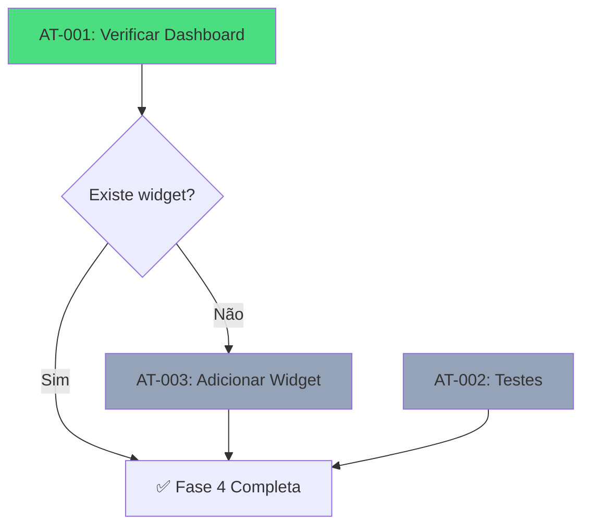

# PRP: Fase 4 - Lógica de Progresso

## Metadata

| Campo              | Valor                                                           |
| ------------------ | --------------------------------------------------------------- |
| **Complexity**     | L2 — Minor enhancements to existing implementation              |
| **Estimated Time** | 1-2 horas                                                       |
| **Parallel Safe**  | Sim (tasks são independentes)                                   |
| **Risk Level**     | Muito Baixo (funcionalidade core já implementada)               |
| **Issues**         | GPU-52                                                          |
| **Dependências**   | Conclusão da Fase 3 (Estrutura de Dados)                        |

---

## 1. Objetivo

Sincronizar o estado real das atividades concluídas com a interface do usuário, fornecendo feedback visual preciso e em tempo real sobre a evolução do mentorado.

---

## 2. Findings Table (APEX Research)

| #   | Finding                                                                      | Confidence | Source                              | Impact    |
| --- | ---------------------------------------------------------------------------- | ---------- | ----------------------------------- | --------- |
| 1   | `getProgress` query **já existe** no backend                                 | 5/5        | atividadesRouter.ts:17-33           | ✅ Done   |
| 2   | `getProgressById` query para admin **já existe**                             | 5/5        | atividadesRouter.ts:39-57           | ✅ Done   |
| 3   | `toggleStep` mutation com refetch **já implementado**                        | 5/5        | AtividadesContent.tsx:91-93         | ✅ Done   |
| 4   | `calcularProgresso` function funcional                                       | 5/5        | atividades-data.ts:520-543          | ✅ Done   |
| 5   | `AtividadesContent.tsx` exibe progresso geral corretamente                   | 5/5        | AtividadesContent.tsx:219-232       | ✅ Done   |
| 6   | `AchievementsView.tsx` usa `ActivityProgressContent` isolado                 | 5/5        | AchievementsView.tsx:73-99          | ✅ Done   |
| 7   | Progresso por atividade exibido no accordion                                 | 5/5        | AtividadesContent.tsx:245-276       | ✅ Done   |
| 8   | ❌ Plano original referencia `AtividadesCard.tsx` que **não existe**         | 5/5        | grep_search + find_by_name          | N/A       |
| 9   | Dashboard principal (`MyDashboard.tsx`) menciona "Progresso Geral" (linha 258)| 4/5        | grep_search                         | Verificar |
| 10  | Testes existentes focam em gamificação, não em atividades                    | 5/5        | gamificacao.test.ts                 | Gap       |

---

## 3. Current Implementation Status

> [!IMPORTANT]
> A funcionalidade core de progresso de atividades **já está implementada** e funcional.

### Backend (✅ Completo)
- Query `getProgress` retorna mapa de progresso do mentorado atual
- Query `getProgressById` permite admin visualizar progresso de qualquer mentorado
- Mutation `toggleStep` atualiza status e faz refetch automático
- Mutation `updateNote` permite adicionar notas pessoais

### Frontend (✅ Completo)
- `AtividadesContent.tsx`: Exibe barra de progresso geral + progresso por atividade
- `AchievementsView.tsx`: Card de "Progresso Geral" na aba de conquistas
- Reatividade: `onSuccess: () => progressQuery.refetch()` já implementado

### Função de Cálculo (✅ Completo)
```typescript
// atividades-data.ts:520-543
export function calcularProgresso(progressMap: Record<string, boolean>): {
  total: number;
  completed: number;
  percentage: number;
}
```

---

## 4. Knowledge Gaps

| Gap                                                  | Status      | Mitigation                                   |
| ---------------------------------------------------- | ----------- | -------------------------------------------- |
| Dashboard principal exibe progresso de atividades?   | A verificar | Verificar MyDashboard.tsx linha 258          |
| Testes unitários para atividadesRouter?              | Não existem | Criar testes básicos (opcional)              |
| Invalidação de cache funciona corretamente?          | A verificar | Testar manualmente marcando/desmarcando step |

---

## 5. Assumptions to Validate

1. ✅ O fluxo de marcar step como concluído atualiza a UI imediatamente (via refetch)
2. ⚠️ O progresso é exibido no dashboard principal (verificar `MyDashboard.tsx`)
3. ✅ Admin pode visualizar progresso de qualquer mentorado

---

## 6. Edge Cases

| #   | Edge Case                                    | Current Handling                               |
| --- | -------------------------------------------- | ---------------------------------------------- |
| 1   | Novo mentorado sem progresso                 | Retorna mapa vazio, progresso = 0%             |
| 2   | Atividade adicionada após mentorado iniciar  | Progresso recalculado automaticamente          |
| 3   | Step marcado/desmarcado rapidamente          | Mutation individual, refetch após cada toggle  |
| 4   | Admin visualiza mentorado sem atividades     | Exibe 0/0 passos (0%)                          |
| 5   | Conexão perdida durante toggle               | TRQ/React Query handles retry automatically    |

---

## 7. Tarefas Atômicas

### ⚡ AT-001: Verificar Exibição no Dashboard Principal

**Dependências:** Nenhuma
**Parallel Safe:** Sim
**Status:** A verificar

**Ação:** Confirmar se `MyDashboard.tsx` exibe o progresso de atividades como card/widget.

**Arquivo:** `client/src/pages/MyDashboard.tsx` (linha 258 menciona "Progresso Geral")

**Validação:**
```bash
bun dev
# Acessar http://localhost:5000/dashboard
# Verificar se existe card de progresso de atividades
```

---

### ⚡ AT-002: (Opcional) Adicionar Teste Unitário para atividadesRouter

**Dependências:** Nenhuma
**Parallel Safe:** Sim
**Status:** Opcional (melhoria de qualidade)

**Ação:** Criar `server/atividades.test.ts` seguindo padrão de `gamificacao.test.ts`.

**Template:**
```typescript
import { describe, it, expect, mock, beforeEach } from "bun:test";

describe("Atividades Router", () => {
  describe("calcularProgresso", () => {
    it("should return 0% for empty map", () => {
      // ...
    });

    it("should calculate correct percentage", () => {
      // ...
    });
  });
});
```

**Validação:**
```bash
bun test server/atividades.test.ts
```

---

### ⚡ AT-003: (Opcional) Adicionar Widget de Progresso no Dashboard

**Dependências:** `[AT-001]` (se verificação mostrar que não existe)
**Parallel Safe:** Sim
**Status:** Condicional

**Ação:** Se `MyDashboard.tsx` não exibir progresso de atividades, adicionar um card de resumo.

**Componente sugerido:**
```tsx
function AtividadesProgressWidget() {
  const { data: progressMap } = trpc.atividades.getProgress.useQuery();
  const { total, completed, percentage } = calcularProgresso(
    Object.fromEntries(
      Object.entries(progressMap || {}).map(([k, v]) => [k, v.completed])
    )
  );

  return (
    <Card>
      <CardHeader>
        <CardTitle>Progresso nas Atividades</CardTitle>
      </CardHeader>
      <CardContent>
        <div className="text-3xl font-bold">{percentage}%</div>
        <Progress value={percentage} />
        <p className="text-sm text-muted-foreground mt-2">
          {completed}/{total} passos concluídos
        </p>
      </CardContent>
    </Card>
  );
}
```

**Validação:**
```bash
bun run check
bun dev # Verificar visualmente no dashboard
```

---

## 8. Verification Plan

### Automated Checks

| Check      | Command          | Expected Result        |
| ---------- | ---------------- | ---------------------- |
| TypeScript | `bun run check`  | Exit code 0, no errors |
| Build      | `bun run build`  | Build succeeds         |

### Manual Verification

1. **Marcar Step como Concluído:**
   - Acessar `/dashboard` → Atividades
   - Clicar em checkbox de qualquer step
   - Verificar que barra de progresso geral atualiza imediatamente
   - Verificar que contador X/Y atualiza

2. **Desmarcar Step:**
   - Clicar novamente no checkbox
   - Verificar que progresso diminui corretamente

3. **Verificar Admin View:**
   - Login como admin
   - Acessar lista de mentorados
   - Clicar em um mentorado
   - Verificar visualização do progresso (read-only)

---

## 9. Dependencies



---

## 10. Conclusão

> [!TIP]
> **A Fase 4 está essencialmente completa!**
>
> A lógica de progresso de atividades já foi implementada durante desenvolvimentos anteriores:
> - Backend: `getProgress`, `toggleStep` funcionais
> - Frontend: `AtividadesContent.tsx` exibe progresso corretamente
> - Reatividade: Refetch automático após cada toggle

O único trabalho restante é:
1. **Verificar** se o dashboard principal exibe um resumo do progresso
2. **Opcionalmente** adicionar testes unitários para cobertura

---

## Pre-Submission Checklist

- [x] Codebase patterns searched and documented
- [x] Existing implementation analyzed
- [x] Findings Table with confidence scores
- [x] Knowledge Gaps explicitly listed
- [x] Assumptions to Validate listed
- [x] Edge cases documented (5)
- [x] Atomic tasks defined
- [x] Validation commands specified
- [x] Dependencies mapped
- [x] Parallel-safe tasks marked

---

## Next Steps

```
✅ Fase 4 já está implementada!

Ações recomendadas:
1. Executar verificação manual (AT-001) para confirmar
2. Prosseguir para Fase 5 (Onboarding) se confirmado
3. Opcionalmente adicionar testes (AT-002)
```
