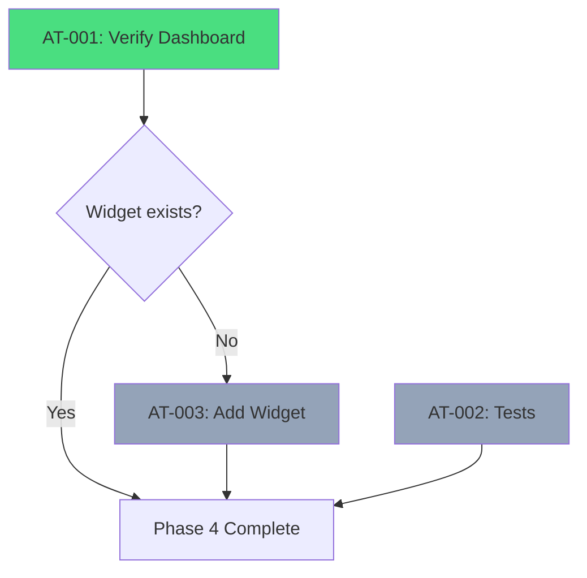

# PRP: Phase 4 - Progress Logic

## Metadata

| Field              | Value                                                           |
| ------------------ | --------------------------------------------------------------- |
| **Complexity**     | L2 — Minor enhancements to existing implementation              |
| **Estimated Time** | 1-2 hours                                                       |
| **Parallel Safe**  | Yes (tasks are independent)                                     |
| **Risk Level**     | Very Low (core functionality already implemented)               |
| **Issues**         | GPU-52                                                          |
| **Dependencies**   | Completion of Phase 3 (Data Structure)                          |

---

## 1. Objective

Synchronize the real state of completed activities with the user interface, providing accurate and real-time visual feedback on the mentee's progress.

---

## 2. Findings Table (APEX Research)

| #   | Finding                                                                      | Confidence | Source                              | Impact    |
| --- | ---------------------------------------------------------------------------- | ---------- | ----------------------------------- | --------- |
| 1   | `getProgress` query **already exists** in the backend                        | 5/5        | atividadesRouter.ts:17-33           | Done      |
| 2   | `getProgressById` query for admin **already exists**                         | 5/5        | atividadesRouter.ts:39-57           | Done      |
| 3   | `toggleStep` mutation with refetch **already implemented**                   | 5/5        | AtividadesContent.tsx:91-93         | Done      |
| 4   | `calcularProgresso` function is functional                                   | 5/5        | atividades-data.ts:520-543          | Done      |
| 5   | `AtividadesContent.tsx` displays overall progress correctly                  | 5/5        | AtividadesContent.tsx:219-232       | Done      |
| 6   | `AchievementsView.tsx` uses isolated `ActivityProgressContent`               | 5/5        | AchievementsView.tsx:73-99          | Done      |
| 7   | Progress per activity displayed in the accordion                             | 5/5        | AtividadesContent.tsx:245-276       | Done      |
| 8   | Original plan references `AtividadesCard.tsx` which **does not exist**       | 5/5        | grep_search + find_by_name          | N/A       |
| 9   | Main dashboard (`MyDashboard.tsx`) mentions "Overall Progress" (line 258)    | 4/5        | grep_search                         | Verify    |
| 10  | Existing tests focus on gamification, not activities                         | 5/5        | gamificacao.test.ts                 | Gap       |

---

## 3. Current Implementation Status

> [!IMPORTANT]
> The core activity progress functionality **is already implemented** and functional.

### Backend (Complete)
- Query `getProgress` returns progress map for the current mentee
- Query `getProgressById` allows admin to view any mentee's progress
- Mutation `toggleStep` updates status and triggers automatic refetch
- Mutation `updateNote` allows adding personal notes

### Frontend (Complete)
- `AtividadesContent.tsx`: Displays overall progress bar + progress per activity
- `AchievementsView.tsx`: "Overall Progress" card in the achievements tab
- Reactivity: `onSuccess: () => progressQuery.refetch()` already implemented

### Calculation Function (Complete)
```typescript
// atividades-data.ts:520-543
export function calcularProgresso(progressMap: Record<string, boolean>): {
  total: number;
  completed: number;
  percentage: number;
}
```

---

## 4. Knowledge Gaps

| Gap                                                  | Status      | Mitigation                                   |
| ---------------------------------------------------- | ----------- | -------------------------------------------- |
| Does the main dashboard display activity progress?   | To verify   | Check MyDashboard.tsx line 258               |
| Unit tests for atividadesRouter?                     | None exist  | Create basic tests (optional)                |
| Does cache invalidation work correctly?              | To verify   | Test manually by marking/unmarking a step    |

---

## 5. Assumptions to Validate

1. The flow of marking a step as completed updates the UI immediately (via refetch)
2. Progress is displayed on the main dashboard (verify `MyDashboard.tsx`)
3. Admin can view any mentee's progress

---

## 6. Edge Cases

| #   | Edge Case                                    | Current Handling                               |
| --- | -------------------------------------------- | ---------------------------------------------- |
| 1   | New mentee without progress                  | Returns empty map, progress = 0%               |
| 2   | Activity added after mentee started          | Progress recalculated automatically            |
| 3   | Step marked/unmarked rapidly                 | Individual mutation, refetch after each toggle  |
| 4   | Admin views mentee without activities        | Displays 0/0 steps (0%)                        |
| 5   | Connection lost during toggle                | tRPC/React Query handles retry automatically   |

---

## 7. Atomic Tasks

### AT-001: Verify Display on Main Dashboard

**Dependencies:** None
**Parallel Safe:** Yes
**Status:** To verify

**Action:** Confirm whether `MyDashboard.tsx` displays activity progress as a card/widget.

**File:** `client/src/pages/MyDashboard.tsx` (line 258 mentions "Overall Progress")

**Validation:**
```bash
bun dev
# Navigate to http://localhost:5000/dashboard
# Verify if an activity progress card exists
```

---

### AT-002: (Optional) Add Unit Test for atividadesRouter

**Dependencies:** None
**Parallel Safe:** Yes
**Status:** Optional (quality improvement)

**Action:** Create `server/atividades.test.ts` following the pattern from `gamificacao.test.ts`.

**Template:**
```typescript
import { describe, it, expect, mock, beforeEach } from "bun:test";

describe("Atividades Router", () => {
  describe("calcularProgresso", () => {
    it("should return 0% for empty map", () => {
      // ...
    });

    it("should calculate correct percentage", () => {
      // ...
    });
  });
});
```

**Validation:**
```bash
bun test server/atividades.test.ts
```

---

### AT-003: (Optional) Add Progress Widget to Dashboard

**Dependencies:** `[AT-001]` (if verification shows it does not exist)
**Parallel Safe:** Yes
**Status:** Conditional

**Action:** If `MyDashboard.tsx` does not display activity progress, add a summary card.

**Suggested component:**
```tsx
function AtividadesProgressWidget() {
  const { data: progressMap } = trpc.atividades.getProgress.useQuery();
  const { total, completed, percentage } = calcularProgresso(
    Object.fromEntries(
      Object.entries(progressMap || {}).map(([k, v]) => [k, v.completed])
    )
  );

  return (
    <Card>
      <CardHeader>
        <CardTitle>Activity Progress</CardTitle>
      </CardHeader>
      <CardContent>
        <div className="text-3xl font-bold">{percentage}%</div>
        <Progress value={percentage} />
        <p className="text-sm text-muted-foreground mt-2">
          {completed}/{total} steps completed
        </p>
      </CardContent>
    </Card>
  );
}
```

**Validation:**
```bash
bun run check
bun dev # Verify visually on the dashboard
```

---

## 8. Verification Plan

### Automated Checks

| Check      | Command          | Expected Result        |
| ---------- | ---------------- | ---------------------- |
| TypeScript | `bun run check`  | Exit code 0, no errors |
| Build      | `bun run build`  | Build succeeds         |

### Manual Verification

1. **Mark a Step as Completed:**
   - Navigate to `/dashboard` -> Activities
   - Click on any step checkbox
   - Verify that the overall progress bar updates immediately
   - Verify that the X/Y counter updates

2. **Unmark a Step:**
   - Click the checkbox again
   - Verify that progress decreases correctly

3. **Verify Admin View:**
   - Log in as admin
   - Access the mentee list
   - Click on a mentee
   - Verify progress visualization (read-only)

---

## 9. Dependencies



---

## 10. Conclusion

> [!TIP]
> **Phase 4 is essentially complete!**
>
> The activity progress logic was already implemented during previous development:
> - Backend: `getProgress`, `toggleStep` are functional
> - Frontend: `AtividadesContent.tsx` displays progress correctly
> - Reactivity: Automatic refetch after each toggle

The only remaining work is:
1. **Verify** whether the main dashboard displays a progress summary
2. **Optionally** add unit tests for coverage

---

## Pre-Submission Checklist

- [x] Codebase patterns searched and documented
- [x] Existing implementation analyzed
- [x] Findings Table with confidence scores
- [x] Knowledge Gaps explicitly listed
- [x] Assumptions to Validate listed
- [x] Edge cases documented (5)
- [x] Atomic tasks defined
- [x] Validation commands specified
- [x] Dependencies mapped
- [x] Parallel-safe tasks marked

---

## Next Steps

```
Phase 4 is already implemented!

Recommended actions:
1. Execute manual verification (AT-001) to confirm
2. Proceed to Phase 5 (Onboarding) if confirmed
3. Optionally add tests (AT-002)
```
