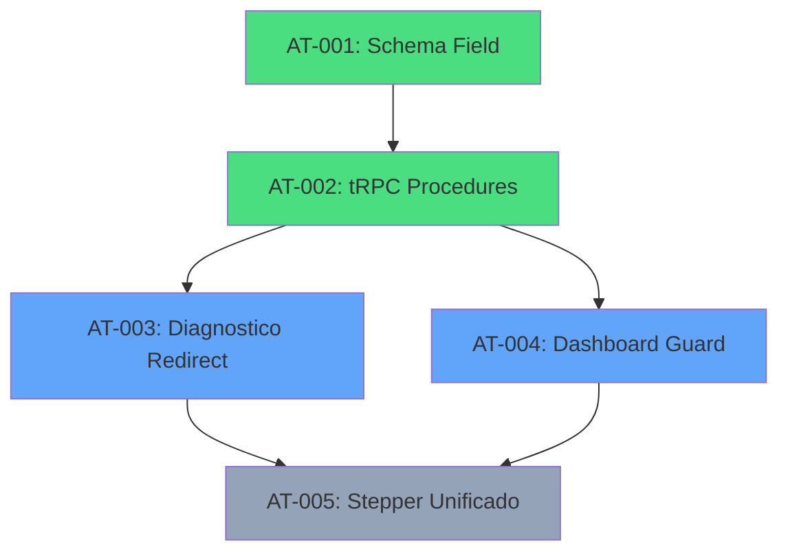

# PRP: Fase 5 - Onboarding

## Metadata

| Campo              | Valor                                                              |
| ------------------ | ------------------------------------------------------------------ |
| **Complexity**     | L4 — Multi-file feature with DB migration + routing logic          |
| **Estimated Time** | 3-4 horas                                                          |
| **Parallel Safe**  | Parcial (AT-001/AT-002 paralelo, AT-003/AT-004 sequencial)         |
| **Risk Level**     | Médio (migração de schema + lógica de redirect)                    |
| **Issues**         | GPU-12                                                             |
| **Dependências**   | Fases 1-2 concluídas                                               |

---

## 1. Objetivo

Criar uma experiência de primeiro acesso guiada e envolvente para novos mentorados, garantindo que eles configurem seus perfis e entendam as funcionalidades da plataforma.

---

## 2. Findings Table (APEX Research)

| #   | Finding                                                                | Confidence | Source                              | Impact     |
| --- | ---------------------------------------------------------------------- | ---------- | ----------------------------------- | ---------- |
| 1   | `PrimeiroAcesso.tsx` (447 linhas) **já existe** com UI de sync         | 5/5        | client/src/pages/PrimeiroAcesso.tsx | ✅ Parcial |
| 2   | `Diagnostico.tsx` (409 linhas) **já existe** com formulário completo   | 5/5        | client/src/pages/Diagnostico.tsx    | ✅ Parcial |
| 3   | Tabela `diagnosticos` com 12+ campos para onboarding **já existe**     | 5/5        | drizzle/schema.ts:681-716           | ✅ Done    |
| 4   | Rota `/primeiro-acesso` **já existe** no Router                        | 5/5        | App.tsx:49                          | ✅ Done    |
| 5   | Rota `/diagnostico` **já existe** no Router                            | 5/5        | App.tsx:52                          | ✅ Done    |
| 6   | ❌ Campo `onboardingCompleted` **NÃO existe** na tabela `users`        | 5/5        | drizzle/schema.ts:82-100            | Gap        |
| 7   | ❌ Campo `onboardingCompleted` **NÃO existe** na tabela `mentorados`   | 5/5        | drizzle/schema.ts:108-134           | Gap        |
| 8   | ❌ **SEM lógica de redirect** automático para onboarding em App.tsx    | 5/5        | App.tsx:38-60                       | Gap        |
| 9   | `DashboardLayout` usado em PrimeiroAcesso.tsx                          | 5/5        | PrimeiroAcesso.tsx:1                | Info       |
| 10  | Página `/comece-aqui` (MentorshipStart.tsx) existe como landing        | 5/5        | App.tsx:43                          | Info       |

---

## 3. Current Implementation Status

> [!IMPORTANT]
> **Infraestrutura parcialmente implementada** - faltam apenas o campo de tracking e a lógica de redirect.

### ✅ Implementado

| Componente                 | Descrição                                      | Arquivo                              |
| -------------------------- | ---------------------------------------------- | ------------------------------------ |
| `PrimeiroAcesso.tsx`       | Página de sincronização Clerk → Mentorado      | client/src/pages/PrimeiroAcesso.tsx  |
| `Diagnostico.tsx`          | Formulário de diagnóstico do negócio           | client/src/pages/Diagnostico.tsx     |
| `diagnosticos` table       | Armazena dados de diagnóstico por mentorado    | drizzle/schema.ts:681-716            |
| Rotas `/primeiro-acesso`   | Roteamento configurado                         | App.tsx:49                           |
| Rotas `/diagnostico`       | Roteamento configurado                         | App.tsx:52                           |

### ❌ Não Implementado (Escopo desta Fase)

| Item                           | Descrição                                      | Impacto                             |
| ------------------------------ | ---------------------------------------------- | ----------------------------------- |
| Campo `onboardingCompleted`    | Flag para tracking de conclusão                | Permite saber quem fez onboarding   |
| Lógica de redirect automático  | Redirecionar novos usuários para onboarding    | UX de primeiro acesso forçada       |
| Stepper unificado (opcional)   | UI multi-step integrada                        | Experiência mais guiada             |

---

## 4. Knowledge Gaps

| Gap                                                        | Mitigation                                            |
| ---------------------------------------------------------- | ----------------------------------------------------- |
| Onde colocar `onboardingCompleted`: users ou mentorados?   | Recomendação: `mentorados` (mais específico)          |
| PrimeiroAcesso e Diagnostico são o mesmo fluxo ou sep.?    | Verificar se devem ser unificados ou sequenciais      |
| Quando marcar onboarding como completo?                    | Após salvar diagnóstico OU após primeiro login?       |

---

## 5. Assumptions to Validate

1. ✅ PrimeiroAcesso sincroniza dados do Clerk com a tabela `mentorados`
2. ⚠️ Mentorado pode editar diagnóstico posteriormente (não é one-time)
3. ⚠️ O fluxo ideal é: Login → PrimeiroAcesso → Diagnostico → Dashboard
4. ⚠️ Admin não precisa passar pelo onboarding

---

## 6. Edge Cases

| #   | Edge Case                                        | Handling                                               |
| --- | ------------------------------------------------ | ------------------------------------------------------ |
| 1   | Usuário fecha browser no meio do onboarding      | `onboardingCompleted` só é true após finalização       |
| 2   | Admin acessa dashboard pela primeira vez         | Pular onboarding para role === 'admin'                 |
| 3   | Mentorado já existente antes do campo ser criado | Marcar como true na migração ou verificar se tem dados |
| 4   | Usuário tenta acessar /dashboard sem onboarding  | Redirect para /primeiro-acesso                         |
| 5   | Usuário acessa /onboarding já tendo completado   | Mostrar página normalmente (pode revisar)              |

---

## 7. Approach Design Decision

> [!NOTE]
> **Decisão arquitetural: EXTEND `mentorados` table**
>
> Adicionar `onboardingCompleted` na tabela `mentorados` (não `users`) porque:
> 1. Onboarding é específico para mentorados (admins não precisam)
> 2. Mantém consistência com outros campos de perfil do mentorado
> 3. Evita migração na tabela `users` (usada por Clerk sync)

---

## 8. Tarefas Atômicas

### ⚡ AT-001: Adicionar Campo `onboardingCompleted` ao Schema

**Dependências:** Nenhuma
**Parallel Safe:** Sim

**Arquivo:** `drizzle/schema.ts`

**Ação:** Adicionar campo booleano à tabela `mentorados`:

```typescript
// Na tabela mentorados (linha ~127)
onboardingCompleted: simNaoEnum("onboarding_completed").default("nao").notNull(),
```

**Validação:**
```bash
bun run db:push  # Aplicar migração
bun run check    # TypeScript
```

**Rollback:**
```bash
# Reverter alteração no schema.ts
# Recriar migração sem o campo
```

---

### ⚡ AT-002: Criar Query e Mutation para Onboarding Status

**Dependências:** `[AT-001]`
**Parallel Safe:** Sim (após AT-001)

**Arquivo:** `server/mentoradosRouter.ts` (ou criar router específico)

**Ação:** Adicionar procedures para verificar e atualizar status:

```typescript
// Query para verificar status
isOnboardingComplete: mentoradoProcedure.query(async ({ ctx }) => {
  return ctx.mentorado.onboardingCompleted === "sim";
}),

// Mutation para marcar como completo
completeOnboarding: mentoradoProcedure.mutation(async ({ ctx }) => {
  const db = getDb();
  await db
    .update(mentorados)
    .set({ onboardingCompleted: "sim" })
    .where(eq(mentorados.id, ctx.mentorado.id));
  return { success: true };
}),
```

**Validação:**
```bash
bun run check
```

---

### AT-003: Implementar Lógica de Redirect no Diagnostico.tsx

**Dependências:** `[AT-002]`
**Parallel Safe:** Não

**Arquivo:** `client/src/pages/Diagnostico.tsx`

**Ação:** Após salvar o diagnóstico, chamar `completeOnboarding` e redirecionar:

```typescript
// No onSuccess do mutation
onSuccess: () => {
  completeOnboardingMutation.mutate();
  toast.success("Diagnóstico salvo com sucesso!");
  navigate("/dashboard");
},
```

**Validação:**
```bash
bun run check
bun dev  # Testar fluxo manualmente
```

---

### AT-004: Implementar Guard de Onboarding em DashboardLayout

**Dependências:** `[AT-002]`
**Parallel Safe:** Não

**Arquivo:** `client/src/components/DashboardLayout.tsx`

**Ação:** Verificar status de onboarding e redirecionar se necessário:

```typescript
// No início do componente
const { data: isComplete, isLoading } = trpc.mentorados.isOnboardingComplete.useQuery();
const [location, navigate] = useLocation();

useEffect(() => {
  if (!isLoading && isComplete === false && !location.startsWith("/primeiro-acesso") && !location.startsWith("/diagnostico")) {
    navigate("/primeiro-acesso");
  }
}, [isComplete, isLoading, location, navigate]);
```

> [!WARNING]
> Excluir rotas `/primeiro-acesso` e `/diagnostico` do redirect para evitar loop infinito.

**Validação:**
```bash
bun run check
bun dev  # Testar com novo usuário
```

---

### AT-005: (Opcional) Unificar Stepper de Onboarding

**Dependências:** `[AT-003, AT-004]`
**Parallel Safe:** Não
**Status:** Opcional - melhor UX

**Ação:** Criar componente `OnboardingStepper.tsx` que combine:
1. Boas-vindas (vídeo)
2. Perfil (PrimeiroAcesso simplificado)
3. Negócio (Diagnostico)
4. Tour (resumo das funcionalidades)

**Estrutura sugerida:**
```
client/src/pages/
└── Onboarding.tsx           # Stepper container
client/src/components/onboarding/
├── WelcomeStep.tsx          # Vídeo de boas-vindas
├── ProfileStep.tsx          # Nome, foto
├── BusinessStep.tsx         # Dados do negócio (do Diagnostico)
└── TourStep.tsx             # Resumo funcionalidades
```

---

## 9. Verification Plan

### Automated Checks

| Check      | Command          | Expected Result        |
| ---------- | ---------------- | ---------------------- |
| TypeScript | `bun run check`  | Exit code 0, no errors |
| Build      | `bun run build`  | Build succeeds         |
| Migrations | `bun run db:push`| Migration applied      |

### Manual Verification

1. **Novo Mentorado (Sem Onboarding):**
   - Criar conta nova via Clerk
   - Ao acessar `/dashboard`, deve redirecionar para `/primeiro-acesso`
   - Completar PrimeiroAcesso → Diagnostico
   - Verificar que agora acessa `/dashboard` normalmente

2. **Mentorado Existente:**
   - Login com conta existente
   - Verificar comportamento baseado no campo `onboardingCompleted`
   - Se migração populou como "sim", deve acessar dashboard diretamente

3. **Admin:**
   - Login como admin
   - Verificar que NÃO é redirecionado para onboarding

---

## 10. Dependencies



**Legenda:** 🟢 Paralelo | 🔵 Sequencial | ⚪ Opcional

---

## 11. Migration Strategy

> [!IMPORTANT]
> **Para mentorados existentes:**
>
> Se já possuem dados na tabela `diagnosticos`, marcar `onboardingCompleted = "sim"` automaticamente.

```sql
-- Dentro da migration ou como script pós-migração
UPDATE mentorados m
SET onboarding_completed = 'sim'
WHERE EXISTS (
  SELECT 1 FROM diagnosticos d WHERE d.mentorado_id = m.id
);
```

---

## 12. User Review Required

> [!WARNING]
> **Decisões que requerem confirmação:**
>
> 1. **Campo em `mentorados` vs `users`** — recomendo mentorados, confirme
> 2. **Onboarding completo após Diagnóstico** — correto ou outro trigger?
> 3. **Mentorados existentes** — marcar todos como onboarding_completed = sim?
> 4. **Stepper unificado (AT-005)** — implementar agora ou fase futura?

---

## Pre-Submission Checklist

- [x] Codebase patterns searched and documented
- [x] Existing implementation analyzed (PrimeiroAcesso, Diagnostico)
- [x] Findings Table with confidence scores
- [x] Knowledge Gaps explicitly listed
- [x] Assumptions to Validate listed
- [x] Edge cases documented (5)
- [x] Atomic tasks defined with rollback steps
- [x] Validation commands specified
- [x] Dependencies mapped
- [x] Parallel-safe tasks marked

---

## Next Steps

```
Após aprovação do plano:
1. Execute /implement para iniciar implementação
2. Siga a ordem: AT-001 → AT-002 → AT-003/AT-004 → AT-005 (opcional)
3. Teste manualmente com novo usuário
```
