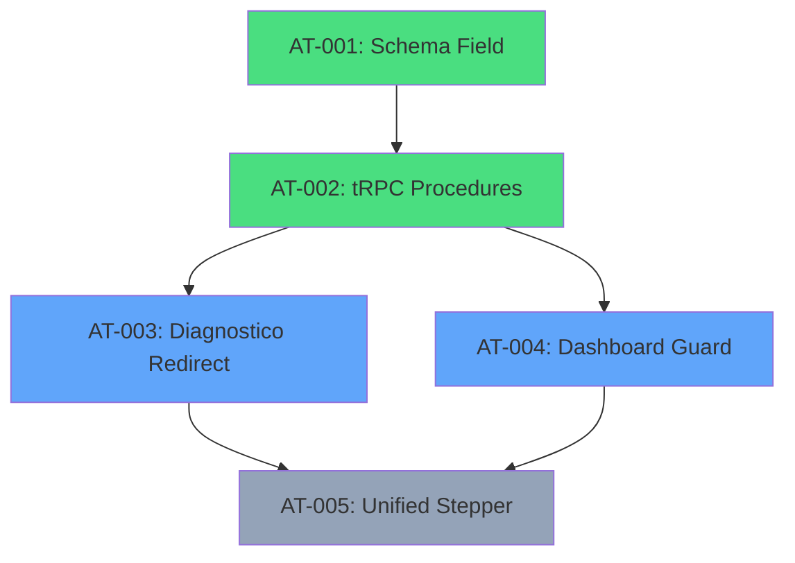

# PRP: Phase 5 - Onboarding

## Metadata

| Field              | Value                                                              |
| ------------------ | ------------------------------------------------------------------ |
| **Complexity**     | L4 — Multi-file feature with DB migration + routing logic          |
| **Estimated Time** | 3-4 hours                                                          |
| **Parallel Safe**  | Partial (AT-001/AT-002 parallel, AT-003/AT-004 sequential)         |
| **Risk Level**     | Medium (schema migration + redirect logic)                         |
| **Issues**         | GPU-12                                                             |
| **Dependencies**   | Phases 1-2 completed                                               |

---

## 1. Objective

Create a guided and engaging first-access experience for new mentees, ensuring they configure their profiles and understand the platform's features.

---

## 2. Findings Table (APEX Research)

| #   | Finding                                                                | Confidence | Source                              | Impact      |
| --- | ---------------------------------------------------------------------- | ---------- | ----------------------------------- | ----------- |
| 1   | `PrimeiroAcesso.tsx` (447 lines) **already exists** with sync UI       | 5/5        | client/src/pages/PrimeiroAcesso.tsx | Partial     |
| 2   | `Diagnostico.tsx` (409 lines) **already exists** with complete form    | 5/5        | client/src/pages/Diagnostico.tsx    | Partial     |
| 3   | `diagnosticos` table with 12+ onboarding fields **already exists**     | 5/5        | drizzle/schema.ts:681-716           | Done        |
| 4   | Route `/primeiro-acesso` **already exists** in the Router              | 5/5        | App.tsx:49                          | Done        |
| 5   | Route `/diagnostico` **already exists** in the Router                  | 5/5        | App.tsx:52                          | Done        |
| 6   | Field `onboardingCompleted` **DOES NOT exist** in the `users` table    | 5/5        | drizzle/schema.ts:82-100            | Gap         |
| 7   | Field `onboardingCompleted` **DOES NOT exist** in the `mentorados` table | 5/5      | drizzle/schema.ts:108-134           | Gap         |
| 8   | **NO automatic redirect** logic for onboarding in App.tsx              | 5/5        | App.tsx:38-60                       | Gap         |
| 9   | `DashboardLayout` used in PrimeiroAcesso.tsx                           | 5/5        | PrimeiroAcesso.tsx:1                | Info        |
| 10  | Page `/comece-aqui` (MentorshipStart.tsx) exists as landing            | 5/5        | App.tsx:43                          | Info        |

---

## 3. Current Implementation Status

> [!IMPORTANT]
> **Infrastructure is partially implemented** — only the tracking field and redirect logic are missing.

### Implemented

| Component                 | Description                                      | File                                 |
| ------------------------- | ------------------------------------------------ | ------------------------------------ |
| `PrimeiroAcesso.tsx`      | Clerk -> Mentee synchronization page             | client/src/pages/PrimeiroAcesso.tsx  |
| `Diagnostico.tsx`         | Business diagnostic form                         | client/src/pages/Diagnostico.tsx     |
| `diagnosticos` table      | Stores diagnostic data per mentee                | drizzle/schema.ts:681-716            |
| `/primeiro-acesso` route  | Routing configured                               | App.tsx:49                           |
| `/diagnostico` route      | Routing configured                               | App.tsx:52                           |

### Not Implemented (Scope of This Phase)

| Item                           | Description                                    | Impact                              |
| ------------------------------ | ---------------------------------------------- | ----------------------------------- |
| `onboardingCompleted` field    | Completion tracking flag                       | Allows knowing who completed onboarding |
| Automatic redirect logic       | Redirect new users to onboarding               | Enforced first-access UX            |
| Unified stepper (optional)     | Multi-step integrated UI                       | More guided experience              |

---

## 4. Knowledge Gaps

| Gap                                                        | Mitigation                                            |
| ---------------------------------------------------------- | ----------------------------------------------------- |
| Where to place `onboardingCompleted`: users or mentorados? | Recommendation: `mentorados` (more specific)          |
| Are PrimeiroAcesso and Diagnostico the same flow or separate? | Verify if they should be unified or sequential     |
| When to mark onboarding as complete?                       | After saving diagnostic OR after first login?         |

---

## 5. Assumptions to Validate

1. PrimeiroAcesso syncs Clerk data with the `mentorados` table
2. Mentee can edit diagnostic later (not a one-time action)
3. The ideal flow is: Login -> PrimeiroAcesso -> Diagnostico -> Dashboard
4. Admin does not need to go through onboarding

---

## 6. Edge Cases

| #   | Edge Case                                        | Handling                                               |
| --- | ------------------------------------------------ | ------------------------------------------------------ |
| 1   | User closes browser during onboarding            | `onboardingCompleted` is only true after finalization  |
| 2   | Admin accesses dashboard for the first time      | Skip onboarding for role === 'admin'                   |
| 3   | Existing mentee before the field was created     | Mark as true during migration or check if they have data |
| 4   | User tries to access /dashboard without onboarding | Redirect to /primeiro-acesso                         |
| 5   | User accesses /onboarding after having completed it | Show the page normally (can review)                  |

---

## 7. Approach Design Decision

> [!NOTE]
> **Architectural decision: EXTEND `mentorados` table**
>
> Add `onboardingCompleted` to the `mentorados` table (not `users`) because:
> 1. Onboarding is specific to mentees (admins do not need it)
> 2. Maintains consistency with other mentee profile fields
> 3. Avoids migration on the `users` table (used by Clerk sync)

---

## 8. Atomic Tasks

### AT-001: Add `onboardingCompleted` Field to Schema

**Dependencies:** None
**Parallel Safe:** Yes

**File:** `drizzle/schema.ts`

**Action:** Add boolean field to the `mentorados` table:

```typescript
// In the mentorados table (line ~127)
onboardingCompleted: simNaoEnum("onboarding_completed").default("nao").notNull(),
```

**Validation:**
```bash
bun run db:push  # Apply migration
bun run check    # TypeScript
```

**Rollback:**
```bash
# Revert change in schema.ts
# Recreate migration without the field
```

---

### AT-002: Create Query and Mutation for Onboarding Status

**Dependencies:** `[AT-001]`
**Parallel Safe:** Yes (after AT-001)

**File:** `server/mentoradosRouter.ts` (or create a specific router)

**Action:** Add procedures to check and update status:

```typescript
// Query to check status
isOnboardingComplete: mentoradoProcedure.query(async ({ ctx }) => {
  return ctx.mentorado.onboardingCompleted === "sim";
}),

// Mutation to mark as complete
completeOnboarding: mentoradoProcedure.mutation(async ({ ctx }) => {
  const db = getDb();
  await db
    .update(mentorados)
    .set({ onboardingCompleted: "sim" })
    .where(eq(mentorados.id, ctx.mentorado.id));
  return { success: true };
}),
```

**Validation:**
```bash
bun run check
```

---

### AT-003: Implement Redirect Logic in Diagnostico.tsx

**Dependencies:** `[AT-002]`
**Parallel Safe:** No

**File:** `client/src/pages/Diagnostico.tsx`

**Action:** After saving the diagnostic, call `completeOnboarding` and redirect:

```typescript
// In the mutation's onSuccess
onSuccess: () => {
  completeOnboardingMutation.mutate();
  toast.success("Diagnostic saved successfully!");
  navigate("/dashboard");
},
```

**Validation:**
```bash
bun run check
bun dev  # Test flow manually
```

---

### AT-004: Implement Onboarding Guard in DashboardLayout

**Dependencies:** `[AT-002]`
**Parallel Safe:** No

**File:** `client/src/components/DashboardLayout.tsx`

**Action:** Check onboarding status and redirect if necessary:

```typescript
// At the beginning of the component
const { data: isComplete, isLoading } = trpc.mentorados.isOnboardingComplete.useQuery();
const [location, navigate] = useLocation();

useEffect(() => {
  if (!isLoading && isComplete === false && !location.startsWith("/primeiro-acesso") && !location.startsWith("/diagnostico")) {
    navigate("/primeiro-acesso");
  }
}, [isComplete, isLoading, location, navigate]);
```

> [!WARNING]
> Exclude `/primeiro-acesso` and `/diagnostico` routes from the redirect to avoid infinite loop.

**Validation:**
```bash
bun run check
bun dev  # Test with a new user
```

---

### AT-005: (Optional) Unified Onboarding Stepper

**Dependencies:** `[AT-003, AT-004]`
**Parallel Safe:** No
**Status:** Optional - better UX

**Action:** Create an `OnboardingStepper.tsx` component that combines:
1. Welcome (video)
2. Profile (simplified PrimeiroAcesso)
3. Business (Diagnostico)
4. Tour (feature overview)

**Suggested structure:**
```
client/src/pages/
└── Onboarding.tsx           # Stepper container
client/src/components/onboarding/
├── WelcomeStep.tsx          # Welcome video
├── ProfileStep.tsx          # Name, photo
├── BusinessStep.tsx         # Business data (from Diagnostico)
└── TourStep.tsx             # Feature overview
```

---

## 9. Verification Plan

### Automated Checks

| Check      | Command          | Expected Result        |
| ---------- | ---------------- | ---------------------- |
| TypeScript | `bun run check`  | Exit code 0, no errors |
| Build      | `bun run build`  | Build succeeds         |
| Migrations | `bun run db:push`| Migration applied      |

### Manual Verification

1. **New Mentee (Without Onboarding):**
   - Create a new account via Clerk
   - When accessing `/dashboard`, should redirect to `/primeiro-acesso`
   - Complete PrimeiroAcesso -> Diagnostico
   - Verify that `/dashboard` is now accessible normally

2. **Existing Mentee:**
   - Log in with an existing account
   - Verify behavior based on the `onboardingCompleted` field
   - If migration set it to "sim", should access dashboard directly

3. **Admin:**
   - Log in as admin
   - Verify that they are NOT redirected to onboarding

---

## 10. Dependencies



**Legend:** Green = Parallel | Blue = Sequential | Gray = Optional

---

## 11. Migration Strategy

> [!IMPORTANT]
> **For existing mentees:**
>
> If they already have data in the `diagnosticos` table, mark `onboardingCompleted = "sim"` automatically.

```sql
-- Inside the migration or as a post-migration script
UPDATE mentorados m
SET onboarding_completed = 'sim'
WHERE EXISTS (
  SELECT 1 FROM diagnosticos d WHERE d.mentorado_id = m.id
);
```

---

## 12. User Review Required

> [!WARNING]
> **Decisions requiring confirmation:**
>
> 1. **Field in `mentorados` vs `users`** — recommendation is mentorados, please confirm
> 2. **Onboarding complete after Diagnostic** — correct or different trigger?
> 3. **Existing mentees** — mark all as onboarding_completed = sim?
> 4. **Unified stepper (AT-005)** — implement now or in a future phase?

---

## Pre-Submission Checklist

- [x] Codebase patterns searched and documented
- [x] Existing implementation analyzed (PrimeiroAcesso, Diagnostico)
- [x] Findings Table with confidence scores
- [x] Knowledge Gaps explicitly listed
- [x] Assumptions to Validate listed
- [x] Edge cases documented (5)
- [x] Atomic tasks defined with rollback steps
- [x] Validation commands specified
- [x] Dependencies mapped
- [x] Parallel-safe tasks marked

---

## Next Steps

```
After plan approval:
1. Execute /implement to start implementation
2. Follow the order: AT-001 -> AT-002 -> AT-003/AT-004 -> AT-005 (optional)
3. Test manually with a new user
```
