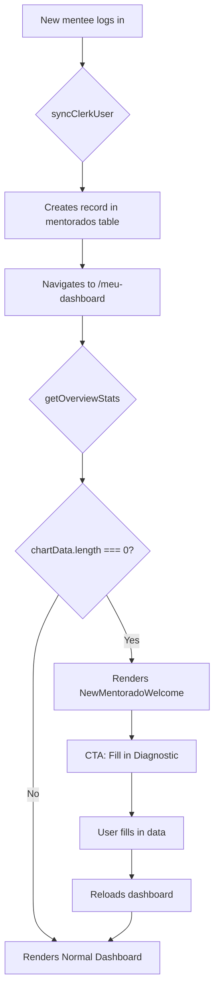

# PLAN-new-mentorado-dashboard: Fix Dashboard Loading for New Mentees

> **Goal:** Resolve the infinite loading issue on the dashboard when a new mentee logs in for the first time.

## 0. Research Findings

| # | Finding | Confidence | Source | Impact |
|---|---------|------------|--------|--------|
| 1 | `syncClerkUser` already creates mentee automatically on first login | 5/5 | `server/services/userService.ts:76-84` | Mentee exists, but without data |
| 2 | `getOverviewStats` returns `chartData: []` when there are no metrics | 5/5 | `server/mentoradosRouter.ts:475-480` | Data technically valid but empty |
| 3 | `MenteeOverview` shows skeleton when `!stats` but never handles `stats.financials.chartData.length === 0` | 5/5 | `client/src/components/dashboard/MenteeOverview.tsx:39-41` | **ROOT CAUSE** |
| 4 | RoadmapView already handles 0% progress correctly | 4/5 | `server/routers/playbook.ts:175-204` | Component works for new users |
| 5 | FinancialHistoryChart does not handle empty array | 4/5 | `client/src/components/dashboard/FinancialHistoryChart.tsx:37-43` | Chart renders without data |
| 6 | NextLiveCard and AITasksCard work independently of metrics | 4/5 | Source code | Not affected |

### Knowledge Gaps & Assumptions

- **Gap:** Could not verify exactly when the skeleton disappears vs. when it should show empty state
- **Assumption:** The problem is purely UI (no infinite loops in the backend)
- **Assumption:** User prefers seeing a "Welcome" message instead of an empty dashboard

### Edge Cases

1. Mentee with filled diagnostic but no monthly metrics
2. Mentee with only 1 month of data (limited history)
3. Admin viewing a new mentee's dashboard
4. Mentee who filled metrics but has no roadmap progress yet
5. Reconnection/reload during first data entry

---

## 1. User Review Required

> [!IMPORTANT]
> **UX Design Decision**
> The proposed solution handles the "empty state" in the UI instead of creating fake data in the database.
> This means new mentees will see a welcome screen with clear instructions.

**Rejected alternative:** Auto-create metrics with value 0 - would pollute the database with meaningless data.

---

## 2. Proposed Changes

### Frontend Components

---

#### [NEW] [NewMentoradoWelcome.tsx](file:///home/mauricio/neondash/client/src/components/dashboard/NewMentoradoWelcome.tsx)

New welcome component for mentees without data:
- Attractive UI with welcome illustration/icon
- Explanation of first steps
- CTA for direct navigation to the "Diagnostic" tab
- Secondary option to fill in "Monthly Metrics"

---

#### [MODIFY] [MenteeOverview.tsx](file:///home/mauricio/neondash/client/src/components/dashboard/MenteeOverview.tsx)

**Action:** Add empty state check before rendering dashboard

```diff
+ import { NewMentoradoWelcome } from "./NewMentoradoWelcome";

  if (isLoading || !stats) {
    return <OverviewSkeleton />;
  }

+ // Check if this is a new mentee without data
+ const hasNoData = stats.financials.chartData.length === 0;
+ if (hasNoData && !isAdmin) {
+   return <NewMentoradoWelcome mentoradoName={mentorado.nomeCompleto} />;
+ }
```

---

#### [MODIFY] [FinancialHistoryChart.tsx](file:///home/mauricio/neondash/client/src/components/dashboard/FinancialHistoryChart.tsx)

**Action:** Handle empty array with friendly message

```diff
+ if (data.length === 0) {
+   return (
+     <Card className="...">
+       <CardContent className="h-[300px] flex items-center justify-center">
+         <p className="text-muted-foreground">No financial data recorded yet.</p>
+       </CardContent>
+     </Card>
+   );
+ }
```

---

## 3. Atomic Implementation Tasks

> [!CAUTION]
> Each task MUST have subtasks. No single-line tasks allowed.

### AT-001: Create NewMentoradoWelcome component
**Goal:** Welcome component for new mentees
**Dependencies:** None

#### Subtasks:
- [ ] ST-001.1: Create file `client/src/components/dashboard/NewMentoradoWelcome.tsx`
  - **File:** `client/src/components/dashboard/NewMentoradoWelcome.tsx`
  - **Validation:** `bun run check` passes
- [ ] ST-001.2: Implement UI with Card, welcome icon and CTAs
  - **File:** `client/src/components/dashboard/NewMentoradoWelcome.tsx`
  - **Validation:** Component renders without errors
- [ ] ST-001.3: Add props for mentee name and navigation callback
  - **File:** `client/src/components/dashboard/NewMentoradoWelcome.tsx`
  - **Validation:** Correct TypeScript types

**Rollback:** Delete `NewMentoradoWelcome.tsx` file

---

### AT-002: Integrate empty state in MenteeOverview
**Goal:** Detect when mentee has no data and show welcome screen
**Dependencies:** AT-001

#### Subtasks:
- [ ] ST-002.1: Import `NewMentoradoWelcome` in `MenteeOverview`
  - **File:** `client/src/components/dashboard/MenteeOverview.tsx`
  - **Validation:** Import without errors
- [ ] ST-002.2: Add `chartData.length === 0` check
  - **File:** `client/src/components/dashboard/MenteeOverview.tsx`
  - **Validation:** Correct condition
- [ ] ST-002.3: Render `NewMentoradoWelcome` when there is no data
  - **File:** `client/src/components/dashboard/MenteeOverview.tsx`
  - **Validation:** New mentee sees welcome screen

**Rollback:** `git checkout client/src/components/dashboard/MenteeOverview.tsx`

---

### AT-003: Handle empty state in FinancialHistoryChart
**Goal:** Show friendly message when there is no data
**Dependencies:** None

#### Subtasks:
- [ ] ST-003.1: Add `data.length === 0` check
  - **File:** `client/src/components/dashboard/FinancialHistoryChart.tsx`
  - **Validation:** Condition before the main return
- [ ] ST-003.2: Render Card with message when there is no data
  - **File:** `client/src/components/dashboard/FinancialHistoryChart.tsx`
  - **Validation:** Chart does not break with empty array

**Rollback:** `git checkout client/src/components/dashboard/FinancialHistoryChart.tsx`

---

### AT-004: E2E Verification
**Goal:** Validate complete flow for a new mentee
**Dependencies:** AT-001, AT-002, AT-003

#### Subtasks:
- [ ] ST-004.1: Run `bun run check` to validate types
  - **Validation:** Zero TypeScript errors
- [ ] ST-004.2: Run `bun run lint` to validate formatting
  - **Validation:** Zero warnings
- [ ] ST-004.3: Manual test: create new user and verify dashboard
  - **Validation:** Welcome screen appears
- [ ] ST-004.4: Manual test: fill in a metric and verify normal dashboard
  - **Validation:** Normal dashboard renders after data entry

**Rollback:** N/A (verification only)

---

## 4. Verification Plan

### Automated Tests

```bash
bun run check   # TypeScript validation
bun run lint    # Biome lint + format
bun test        # Vitest (if relevant tests exist)
```

### Manual Verification

1. **Create new user in Clerk**
   - Log in with an email that does not exist in the database
   - Verify that mentee is created automatically

2. **Verify Empty Dashboard**
   - Navigate to `/meu-dashboard`
   - Should show welcome screen with CTAs
   - Should NOT show infinite skeleton

3. **Fill in First Metric**
   - Go to "Diagnostic" tab or fill in monthly metric
   - Return to "Overview"
   - Dashboard should render normally

4. **Test as Admin**
   - As admin, select a new mentee
   - Should show empty data (not welcome screen) for admin

---

## 5. Rollback Plan

```bash
# If all changes need to be reverted:
git checkout client/src/components/dashboard/MenteeOverview.tsx
git checkout client/src/components/dashboard/FinancialHistoryChart.tsx
rm client/src/components/dashboard/NewMentoradoWelcome.tsx

# Rebuild
bun run check
```

---

## 6. Flow Diagram


