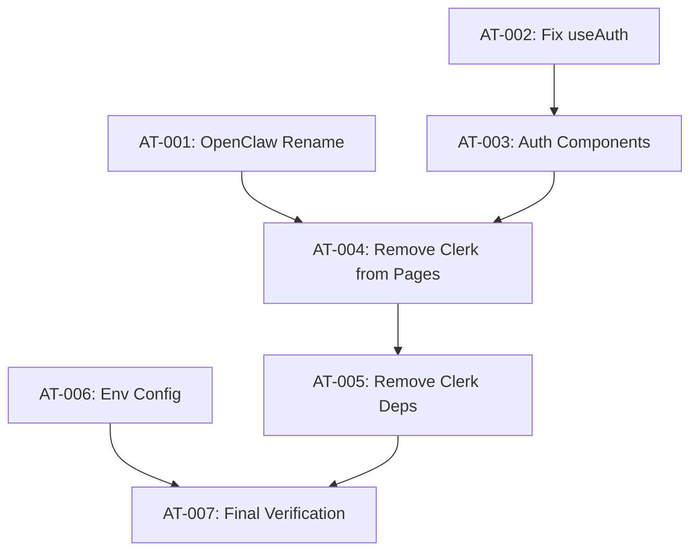

# PLAN-openclaw-integration: Fix OpenClaw (Moltbot) Integration

> **Goal:** Fix the OpenClaw AI assistant integration by removing Clerk dependencies and validating the complete chat flow.

## 0. Research Findings

| # | Finding | Confidence | Source | Impact |
|---|---------|------------|--------|--------|
| 1 | Clerk still present in 10 files | 5/5 | grep_search | Critical - breaks auth |
| 2 | `MOLTBOT_GATEWAY_URL` only in dist/index.js | 4/5 | grep_search | Missing from .env.example |
| 3 | Backend renamed to OpenClaw (service/router) | 5/5 | Previous edits | Partially complete |
| 4 | Schema exports renamed, tables unchanged | 5/5 | Previous edits | DB compatible |
| 5 | Frontend files need OpenClaw rename + Clerk removal | 5/5 | Analysis | Critical path |
| 6 | tRPC router now registered as `openclaw` | 5/5 | routers.ts | API namespace changed |

### Knowledge Gaps & Assumptions
- **Gap:** Is `useAuth` hook currently functional without Clerk?
- **Gap:** Does Manus Auth exist or need implementation?
- **Assumption:** Backend auth via `ctx.user` works independently of Clerk
- **Assumption:** Gateway Moltbot CLI is available via `bunx moltbot`

---

## 1. User Review Required

> [!IMPORTANT]
> **Authentication Strategy Needed:**
> 
> The user mentioned "Manus Auth" as replacement for Clerk, but this system doesn't exist in the codebase.
> 
> **Options:**
> 1. **Remove Clerk, use existing backend auth** - `ctx.user` from tRPC context works
> 2. **Implement Manus OAuth** - Requires OAuth provider setup
> 3. **Keep minimal Clerk** - Remove UI components only, keep auth logic
> 
> **Recommendation:** Option 1 - The backend already authenticates via session/JWT in `server/_core/context.ts`. We just need to remove Clerk UI components and use `useAuth` hook that queries tRPC.

> [!WARNING]
> **Partial Rename Already Done:**
> 
> - ✅ `moltbotService.ts` → `openclawService.ts`
> - ✅ `moltbotRouter.ts` → `openclawRouter.ts`
> - ✅ Schema exports renamed
> - ✅ tRPC router registered as `openclaw`
> - ❌ Frontend still references `trpc.moltbot.*`
> - ❌ Frontend files not renamed
> 
> We need to complete the rename AND fix auth simultaneously.

---

## 2. Proposed Changes

### Phase 1: Complete OpenClaw Rename (Frontend)

#### [MODIFY] [useOpenClaw.ts](file:///home/mauricio/neondash/client/src/hooks/useOpenClaw.ts)
- **Action:** Update tRPC calls from `trpc.moltbot.*` to `trpc.openclaw.*`
- **Action:** Rename function from `useMoltbot` to `useOpenClaw`
- **Action:** Update WebSocket URL from `/ws/moltbot` to `/ws/openclaw`
- **Action:** Rename interface from `UseMoltbotReturn` to `UseOpenClawReturn`

#### [MODIFY] [OpenClawPage.tsx](file:///home/mauricio/neondash/client/src/pages/OpenClawPage.tsx)
- **Action:** Update tRPC call from `getMoltbotContext` to `getOpenClawContext`
- **Action:** Update component import from `useMoltbot` to `useOpenClaw`
- **Action:** Update UI text from "Moltbot" to "OpenClaw"

#### [MODIFY] [ChatInterface.tsx](file:///home/mauricio/neondash/client/src/components/openclaw/ChatInterface.tsx)
- **Action:** Update any Moltbot references in comments/UI

#### [MODIFY] [App.tsx](file:///home/mauricio/neondash/client/src/App.tsx)
- **Action:** Update lazy import from `MoltbotPage` to `OpenClawPage`

---

### Phase 2: Remove Clerk Dependencies

#### [MODIFY] [DashboardLayout.tsx](file:///home/mauricio/neondash/client/src/components/DashboardLayout.tsx)
- **Action:** Remove `import { UserButton } from "@clerk/clerk-react"`
- **Action:** Replace `<UserButton />` with custom logout button using `useAuth` hook

#### [MODIFY] [main.tsx](file:///home/mauricio/neondash/client/src/main.tsx)
- **Action:** Remove `import { ClerkProvider }` 
- **Action:** Remove `<ClerkProvider>` wrapper

#### [MODIFY] [useAuth.ts](file:///home/mauricio/neondash/client/src/_core/hooks/useAuth.ts)
- **Action:** Remove Clerk imports
- **Action:** Use tRPC query `auth.getSession` for user data

#### [MODIFY] [ProtectedRoute.tsx](file:///home/mauricio/neondash/client/src/components/auth/ProtectedRoute.tsx)
- **Action:** Replace Clerk `useAuth` with local `useAuth` hook

#### [MODIFY] [AuthSync.tsx](file:///home/mauricio/neondash/client/src/components/auth/AuthSync.tsx)
- **Action:** Remove Clerk dependency or delete file if unused

#### [MODIFY] [SignInButton.tsx](file:///home/mauricio/neondash/client/src/components/auth/SignInButton.tsx)
- **Action:** Create custom login button (redirect to login page)

#### [MODIFY] [UserButton.tsx](file:///home/mauricio/neondash/client/src/components/auth/UserButton.tsx)
- **Action:** Create custom user dropdown with shadcn/ui

#### [MODIFY] [LandingPage.tsx](file:///home/mauricio/neondash/client/src/pages/LandingPage.tsx)
- **Action:** Replace Clerk `SignInButton` with custom component

#### [MODIFY] [MentorshipContent.tsx](file:///home/mauricio/neondash/client/src/components/landing/MentorshipContent.tsx)
- **Action:** Replace `SignedIn/SignedOut` with conditional rendering

#### [MODIFY] [LeadsPage.tsx](file:///home/mauricio/neondash/client/src/pages/crm/LeadsPage.tsx)
- **Action:** Replace `useUser` with `useAuth` hook

---

### Phase 3: Environment Configuration

#### [MODIFY] [.env.example](file:///home/mauricio/neondash/.env.example)
- **Action:** Add `OPENCLAW_GATEWAY_URL=ws://127.0.0.1:18789`

#### [DELETE] Clerk environment variables
- **Action:** Remove `VITE_CLERK_PUBLISHABLE_KEY` and `CLERK_SECRET_KEY`

---

### Phase 4: Cleanup & Dependencies

#### [MODIFY] [package.json](file:///home/mauricio/neondash/package.json)
- **Action:** Run `bun remove @clerk/clerk-react @clerk/express`
- **Action:** Verify `moltbot` dependency for CLI

---

## 3. Atomic Implementation Tasks

> [!CAUTION]
> Each task has subtasks with validation. Follow in order.

### AT-001: Complete Frontend OpenClaw Rename
**Goal:** Update all frontend files to use `openclaw` instead of `moltbot`
**Dependencies:** None

#### Subtasks:
- [ ] ST-001.1: Update `useOpenClaw.ts` hook
  - **File:** `client/src/hooks/useOpenClaw.ts`
  - **Changes:** Rename function, update tRPC calls to `trpc.openclaw.*`, update WS URL
  - **Validation:** File compiles without errors
- [ ] ST-001.2: Update `OpenClawPage.tsx` page
  - **File:** `client/src/pages/OpenClawPage.tsx`
  - **Changes:** Update tRPC call, import hook, update UI text
  - **Validation:** Page renders without errors
- [ ] ST-001.3: Update `App.tsx` routing
  - **File:** `client/src/App.tsx`
  - **Changes:** Update lazy import path and component name
  - **Validation:** Route `/assistente` loads correctly

**Rollback:** `git checkout HEAD -- client/src/hooks/ client/src/pages/`

---

### AT-002: Remove Clerk from useAuth Hook
**Goal:** Make `useAuth` hook work without Clerk
**Dependencies:** None (parallel with AT-001) ⚡

#### Subtasks:
- [ ] ST-002.1: View current `useAuth.ts` implementation
  - **File:** `client/src/_core/hooks/useAuth.ts`
  - **Validation:** Understand current Clerk dependencies
- [ ] ST-002.2: Implement session-based auth
  - **File:** `client/src/_core/hooks/useAuth.ts`
  - **Changes:** Use `trpc.auth.getSession` query, remove Clerk imports
  - **Validation:** Hook returns `{ user, isAuthenticated, isLoading }`
- [ ] ST-002.3: Test auth hook
  - **Validation:** `bun run check` passes for this file

**Rollback:** `git checkout HEAD -- client/src/_core/hooks/useAuth.ts`

---

### AT-003: Remove Clerk from Auth Components
**Goal:** Create custom auth components without Clerk
**Dependencies:** AT-002

#### Subtasks:
- [ ] ST-003.1: Update `ProtectedRoute.tsx`
  - **File:** `client/src/components/auth/ProtectedRoute.tsx`
  - **Changes:** Import local `useAuth`, remove Clerk import
  - **Validation:** Protected routes still redirect when not authenticated
- [ ] ST-003.2: Update `SignInButton.tsx`
  - **File:** `client/src/components/auth/SignInButton.tsx`
  - **Changes:** Create button that redirects to `/login` or OAuth URL
  - **Validation:** Button renders and navigates correctly
- [ ] ST-003.3: Update `UserButton.tsx`
  - **File:** `client/src/components/auth/UserButton.tsx`
  - **Changes:** Create dropdown with avatar and logout option
  - **Validation:** Dropdown shows user info and logout works
- [ ] ST-003.4: Update or remove `AuthSync.tsx`
  - **File:** `client/src/components/auth/AuthSync.tsx`
  - **Changes:** Remove Clerk sync logic
  - **Validation:** No Clerk imports in file

**Rollback:** `git checkout HEAD -- client/src/components/auth/`

---

### AT-004: Remove Clerk from Layout & Pages
**Goal:** Remove remaining Clerk dependencies from pages
**Dependencies:** AT-003

#### Subtasks:
- [ ] ST-004.1: Update `DashboardLayout.tsx`
  - **File:** `client/src/components/DashboardLayout.tsx`
  - **Changes:** Remove Clerk `UserButton`, use custom component
  - **Validation:** Layout renders with custom user button
- [ ] ST-004.2: Update `main.tsx`
  - **File:** `client/src/main.tsx`
  - **Changes:** Remove `ClerkProvider` wrapper
  - **Validation:** App bootstraps without Clerk
- [ ] ST-004.3: Update `LandingPage.tsx`
  - **File:** `client/src/pages/LandingPage.tsx`
  - **Changes:** Use custom `SignInButton`
  - **Validation:** Landing page renders login button
- [ ] ST-004.4: Update `MentorshipContent.tsx`
  - **File:** `client/src/components/landing/MentorshipContent.tsx`
  - **Changes:** Replace `SignedIn/SignedOut` with `useAuth` conditional
  - **Validation:** Content shows based on auth state
- [ ] ST-004.5: Update `LeadsPage.tsx`
  - **File:** `client/src/pages/crm/LeadsPage.tsx`
  - **Changes:** Replace `useUser` with `useAuth`
  - **Validation:** Page loads user data correctly

**Rollback:** `git checkout HEAD -- client/src/components/DashboardLayout.tsx client/src/main.tsx client/src/pages/`

---

### AT-005: Remove Clerk Dependencies from package.json
**Goal:** Uninstall Clerk packages
**Dependencies:** AT-004

#### Subtasks:
- [ ] ST-005.1: Remove Clerk packages
  - **Command:** `bun remove @clerk/clerk-react @clerk/express`
  - **Validation:** Packages removed from `package.json`
- [ ] ST-005.2: Clean install
  - **Command:** `bun install`
  - **Validation:** No Clerk packages in `node_modules`
- [ ] ST-005.3: Verify build
  - **Command:** `bun run check && bun run build`
  - **Validation:** Build succeeds without Clerk errors

**Rollback:** `bun add @clerk/clerk-react @clerk/express`

---

### AT-006: Update Environment Configuration
**Goal:** Document OpenClaw gateway configuration
**Dependencies:** None (parallel) ⚡

#### Subtasks:
- [ ] ST-006.1: Update `.env.example`
  - **File:** `.env.example`
  - **Changes:** Add `OPENCLAW_GATEWAY_URL=ws://127.0.0.1:18789`, remove Clerk vars
  - **Validation:** File documents all required vars
- [ ] ST-006.2: Verify `.env` has gateway URL
  - **File:** `.env`
  - **Validation:** `OPENCLAW_GATEWAY_URL` is set

**Rollback:** N/A

---

### AT-007: Final Verification & Testing
**Goal:** Validate complete integration
**Dependencies:** AT-001 through AT-006

#### Subtasks:
- [ ] ST-007.1: TypeScript check
  - **Command:** `bun run check`
  - **Validation:** Zero errors
- [ ] ST-007.2: Lint check
  - **Command:** `bun run lint`
  - **Validation:** Zero errors
- [ ] ST-007.3: Build test
  - **Command:** `bun run build`
  - **Validation:** Build succeeds
- [ ] ST-007.4: Start dev server
  - **Command:** `bun dev`
  - **Validation:** Server starts, no Clerk errors
- [ ] ST-007.5: Test `/assistente` page
  - **Browser:** Navigate to `/assistente`
  - **Validation:** Chat interface loads

**Rollback:** N/A

---

## 4. Verification Plan

### Automated Tests
```bash
bun run check       # TypeScript validation
bun run lint        # Code formatting
bun run build       # Production build
```

### Manual Verification
1. Start dev server: `bun dev`
2. Access `/assistente`
3. Verify chat interface loads
4. Verify no Clerk errors in console
5. Test login/logout flow

---

## 5. Rollback Plan

```bash
# If critical issues occur:
git stash                          # Save current work
git checkout HEAD -- client/src/   # Restore frontend
bun add @clerk/clerk-react @clerk/express  # Restore Clerk
bun install                        # Reinstall deps
```

---

## 6. Execution Order



**Parallel Tasks:** AT-001 ⚡ AT-002 ⚡ AT-006
