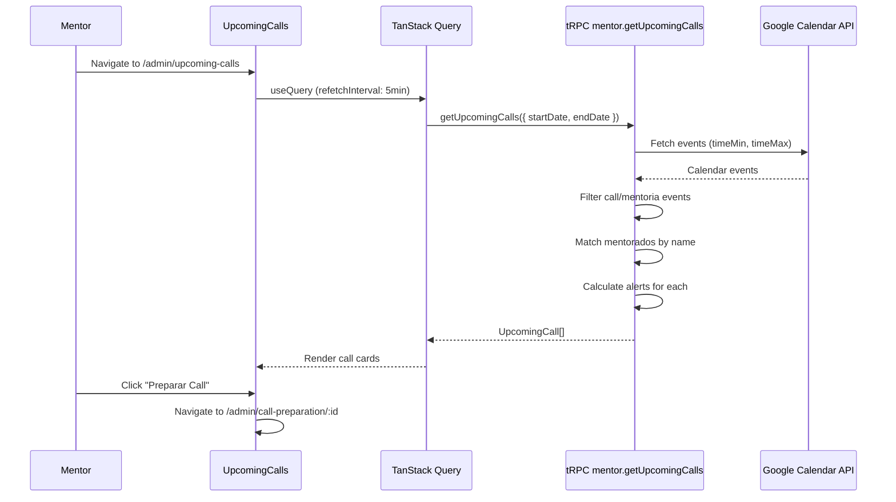

# PLAN-upcoming-calls: Upcoming Calls Page

> **Goal:** Create a frontend page to display upcoming calls from Google Calendar with filtering, search, and alert indicators.

---

## 0. Research Findings

| # | Finding | Confidence | Source | Impact |
|---|---------|------------|--------|--------|
| 1 | Backend `getUpcomingCalls` procedure is complete with date filtering, name matching, and alert calculation | 5/5 | [mentor.ts](file:///home/mauricio/neondash/server/routers/mentor.ts#L147-L222) | Backend ready, focus on frontend |
| 2 | `UpcomingCall` type already defined with `eventId`, `title`, `start`, `end`, `mentoradoId`, `mentoradoNome`, `alerts[]` | 5/5 | [mentor.ts](file:///home/mauricio/neondash/server/types/mentor.ts#L110-L118) | Types ready to use |
| 3 | `CallPreparation` page exists at `/admin/call-preparation/:mentoradoId` with established patterns | 5/5 | [CallPreparation.tsx](file:///home/mauricio/neondash/client/src/pages/CallPreparation.tsx) | Navigation target exists |
| 4 | Badge component needs `warning` variant (only has default/secondary/destructive/outline) | 5/5 | [badge.tsx](file:///home/mauricio/neondash/client/src/components/ui/badge.tsx) | Need to add warning variant |
| 5 | Empty state component available with EmptyTitle/EmptyDescription/EmptyMedia | 5/5 | [empty.tsx](file:///home/mauricio/neondash/client/src/components/ui/empty.tsx) | Use for empty states |
| 6 | DashboardLayout already imports `CalendarRange` icon from lucide-react | 5/5 | [DashboardLayout.tsx](file:///home/mauricio/neondash/client/src/components/DashboardLayout.tsx#L6) | Can reuse for nav item |
| 7 | No existing UpcomingCalls page in `client/src/pages/` | 5/5 | Codebase search | Need to create from scratch |

### Knowledge Gaps & Assumptions

- **Assumption:** User wants "Esta Semana", "Este Mês", "Todas" filters as described in original plan
- **Assumption:** 5-minute auto-refetch is acceptable for data freshness
- **Assumption:** Grid layout (responsive 1/2/3 columns) is preferred over list view

---

## 1. User Review Required

> [!IMPORTANT]
> **Badge Warning Variant:** Adding a `warning` variant to the Badge component (yellow background). This extends the existing shadcn component.

---

## 2. Proposed Changes

### UI Component Extension

#### [MODIFY] [badge.tsx](file:///home/mauricio/neondash/client/src/components/ui/badge.tsx)

- **Action:** Add `warning` variant for yellow/amber alert badges
- **Details:** Add new variant with amber background and dark text for visibility

---

### Page Component

#### [NEW] [UpcomingCalls.tsx](file:///home/mauricio/neondash/client/src/pages/UpcomingCalls.tsx)

- **Action:** Create new page component with filters, search, and call cards
- **Details:**
  - Wrap in `DashboardLayout`
  - Use `trpc.mentor.getUpcomingCalls.useQuery()` with 5-min refetch
  - Three filter buttons: "Esta Semana", "Este Mês", "Todas"
  - Debounced search input (300ms)
  - Call cards with Avatar, badges, "Preparar Call" button
  - Loading skeleton, empty states, error handling

---

### Routing & Navigation

#### [MODIFY] [App.tsx](file:///home/mauricio/neondash/client/src/App.tsx)

- **Action:** Add route for `/admin/upcoming-calls`
- **Details:**
  - Import with lazy loading pattern
  - Add route in Switch after other admin routes

#### [MODIFY] [DashboardLayout.tsx](file:///home/mauricio/neondash/client/src/components/DashboardLayout.tsx)

- **Action:** Add navigation item "Próximas Calls" for admins
- **Details:**
  - Insert after "Painel Administrativo" item
  - Use `CalendarRange` icon (already imported)
  - `adminOnly: true`

---

## 3. Atomic Implementation Tasks

> [!CAUTION]
> Each task MUST have subtasks. No single-line tasks allowed.

### AT-001: Add Warning Variant to Badge ⚡
**Goal:** Extend Badge component with yellow warning variant
**Dependencies:** None

#### Subtasks:
- [ ] ST-001.1: Add `warning` variant to `badgeVariants` in badge.tsx
  - **File:** `client/src/components/ui/badge.tsx`
  - **Validation:** `bun run check` passes, variant appears in types
- [ ] ST-001.2: Test variant visually with amber/yellow styling
  - **File:** N/A (visual check)
  - **Validation:** Badge renders with correct colors

**Rollback:** Remove warning variant line from badgeVariants

---

### AT-002: Create UpcomingCalls Page Component
**Goal:** Build the main page with call cards, filters, and search
**Dependencies:** AT-001

#### Subtasks:
- [ ] ST-002.1: Create file with DashboardLayout wrapper and page header
  - **File:** `client/src/pages/UpcomingCalls.tsx`
  - **Validation:** File exists, imports correctly
- [ ] ST-002.2: Add tRPC query with date range and 5-min refetch
  - **File:** `client/src/pages/UpcomingCalls.tsx`
  - **Validation:** Query executes on page load
- [ ] ST-002.3: Implement filter buttons (Esta Semana/Este Mês/Todas)
  - **File:** `client/src/pages/UpcomingCalls.tsx`
  - **Validation:** Filters change query parameters
- [ ] ST-002.4: Add debounced search input for mentorado filtering
  - **File:** `client/src/pages/UpcomingCalls.tsx`
  - **Validation:** Search filters results client-side
- [ ] ST-002.5: Create CallCard sub-component with Avatar, badges, button
  - **File:** `client/src/pages/UpcomingCalls.tsx`
  - **Validation:** Cards display with correct layout
- [ ] ST-002.6: Add loading skeleton pattern matching CallPreparation
  - **File:** `client/src/pages/UpcomingCalls.tsx`
  - **Validation:** Skeleton shows during loading
- [ ] ST-002.7: Add empty state using Empty component
  - **File:** `client/src/pages/UpcomingCalls.tsx`
  - **Validation:** Empty state shows when no calls
- [ ] ST-002.8: Handle PRECONDITION_FAILED error for Google Calendar not connected
  - **File:** `client/src/pages/UpcomingCalls.tsx`
  - **Validation:** Error alert shows with settings link

**Rollback:** Delete `client/src/pages/UpcomingCalls.tsx`

---

### AT-003: Add Route to Application ⚡
**Goal:** Register UpcomingCalls route in App.tsx
**Dependencies:** AT-002

#### Subtasks:
- [ ] ST-003.1: Add lazy import for UpcomingCalls page
  - **File:** `client/src/App.tsx`
  - **Validation:** Import statement exists
- [ ] ST-003.2: Add Route path="/admin/upcoming-calls"
  - **File:** `client/src/App.tsx`
  - **Validation:** Route renders page at URL

**Rollback:** Remove import and Route from App.tsx

---

### AT-004: Update Navigation Menu ⚡
**Goal:** Add "Próximas Calls" to sidebar navigation
**Dependencies:** AT-003

#### Subtasks:
- [ ] ST-004.1: Add nav item after "Painel Administrativo"
  - **File:** `client/src/components/DashboardLayout.tsx`
  - **Validation:** Item appears in sidebar for admins
- [ ] ST-004.2: Verify adminOnly restriction works
  - **File:** `client/src/components/DashboardLayout.tsx`
  - **Validation:** Item hidden for non-admin users

**Rollback:** Remove nav item from navItems array

---

## 4. Verification Plan

### Automated Tests

```bash
# TypeScript validation
bun run check

# Lint and format
bun run lint:check
```

### Manual Verification

> [!NOTE]
> These tests require an admin user with Google Calendar connected

#### Test 1: Page Renders
1. Start dev server: `bun dev`
2. Login as admin user
3. Navigate to `/admin/upcoming-calls`
4. **Expected:** Page loads with header "Próximas Calls" and filter buttons

#### Test 2: Filters Work
1. Click "Esta Semana" button
2. **Expected:** Query refetches, only events within current week shown
3. Click "Este Mês" button
4. **Expected:** Query refetches, events within current month shown
5. Click "Todas" button
6. **Expected:** Query refetches, all upcoming events (3 months) shown

#### Test 3: Search Works
1. Type a mentorado name in search box
2. Wait 300ms for debounce
3. **Expected:** Only matching call cards visible

#### Test 4: Alert Badges Display
1. Find a call with mentorado who has alerts
2. **Expected:** Red badge shows for critical alerts, yellow for warnings
3. Find a call with mentorado who has no metrics
4. **Expected:** "Sem registro" outline badge visible

#### Test 5: Navigation Works
1. Click "Preparar Call" button on a card
2. **Expected:** Navigates to `/admin/call-preparation/:mentoradoId`
3. Verify CallPreparation page loads correctly

#### Test 6: Sidebar Navigation
1. Open sidebar (expand if collapsed)
2. **Expected:** "Próximas Calls" item visible with Calendar icon
3. Click the item
4. **Expected:** Navigates to `/admin/upcoming-calls`

#### Test 7: Error State (Google Calendar not connected)
1. Use a user without Google Calendar connected
2. Navigate to `/admin/upcoming-calls`
3. **Expected:** Alert shows "Google Calendar não conectado" message

#### Test 8: Empty State
1. Use filter that returns no calls
2. **Expected:** Empty state component shows with message

#### Test 9: Loading State
1. Navigate to page with network throttling enabled
2. **Expected:** Skeleton loading state visible until data loads

---

## 5. Rollback Plan

```bash
# If issues arise, revert all changes:
git checkout -- client/src/pages/UpcomingCalls.tsx
git checkout -- client/src/App.tsx
git checkout -- client/src/components/DashboardLayout.tsx
git checkout -- client/src/components/ui/badge.tsx

# Or if committed:
git revert HEAD~1  # Revert last commit
```

---

## 6. Data Flow Diagram



---

## 7. Component Hierarchy

```
UpcomingCalls (page)
├── DashboardLayout (wrapper)
├── PageHeader
│   ├── Title: "Próximas Calls"
│   └── Subtitle: count of calls
├── FilterToolbar
│   ├── FilterButtons (Esta Semana | Este Mês | Todas)
│   └── SearchInput
├── CallsGrid
│   └── CallCard[] (mapped from data)
│       ├── Avatar
│       ├── CallInfo
│       │   ├── MentoradoName
│       │   └── DateTime
│       ├── AlertBadges
│       │   ├── CriticalBadge (🔴)
│       │   ├── WarningBadge (🟡)
│       │   └── NoMetricsBadge
│       └── PrepareButton
└── EmptyState (conditional)
```
