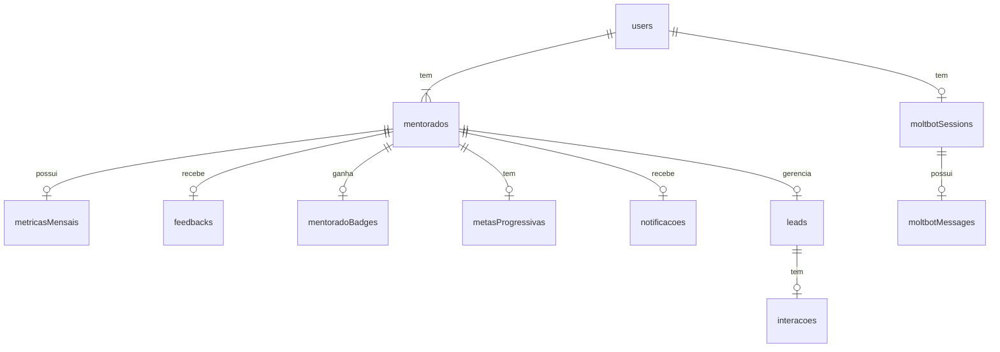

# PROMPT: Implementação de Isolamento de Dados por Mentorado (Row-Level Security)

## OBJECTIVE

Implementar isolamento completo de dados no nível da aplicação usando **Row-Level Security (RLS)** no backend para garantir que cada mentorado veja apenas seus próprios dados e admin veja todos os dados. **ZERO** vazamento de dados entre mentorados.

---

## PROJECT CONTEXT

- **Project**: NEON Dashboard (Portal mentorias.black)
- **Tech Stack**: React 19 + Vite 7 + tRPC 11 + Drizzle ORM + Neon PostgreSQL + Express + Clerk + Bun
- **Auth**: Clerk (clerkId → users.userId → mentorados.userId)
- **Current Issue**: Dados não estão isolados por mentorado após login

---

## DATABASE RELATIONSHIP (CRITICAL)



**Path de Autorização:**

```
Clerk Auth → users.clerkId → users.id → mentorados.userId → mentorados.id
```

---

## ARCHITECTURE FOR DATA ISOLATION

### 1. CONTEXT AUGMENTATION

**File:** `server/_core/context.ts`

Execute as alterações para resolver o erro de propriedade `clerkId`:

```typescript
import { ClerkExpressRequireAuth } from "@clerk/express";
import type { NodeHTTPCreateContextFnOptions } from "@trpc/server/adapters/node-http";
import { getSession } from "@clerk/nextjs/server";
import { db } from "./db";
import { users } from "../drizzle/schema";
import { eq } from "drizzle-orm";

export const createContext = async (
  opts: NodeHTTPCreateContextFnOptions
): Promise<TrpcContext> => {
  const req = opts.req;
  const auth = req.auth;

  let user = null;
  let mentorado = null;

  if (auth?.userId) {
    // Fetch user by clerkId
    const userRow = await db
      .select()
      .from(users)
      .where(eq(users.clerkId, auth.userId))
      .limit(1);

    user = userRow[0] || null;

    // If user exists, fetch mentorado profile by userId
    if (user) {
      const mentoradoRow = await db
        .select()
        .from(mentorados)
        .where(eq(mentorados.userId, user.id))
        .limit(1);

      mentorado = mentoradoRow[0] || null;
    }
  }

  return {
    req,
    user,
    mentorado,
    db,
  };
};
```

**Type Definition:** `server/_core/types.ts` (create if doesn't exist)

```typescript
import type { DrizzleDB } from "../db";
import type { User, Mentorado } from "../drizzle/schema";

export interface TrpcContext {
  req: any;
  user: User | null;
  mentorado: Mentorado | null;
  db: DrizzleDB;
}
```

---

### 2. MIDDLEWARE FOR MENTORADO-AWARE PROCEDURES

**File:** `server/_core/trpc.ts`

Add new middleware:

```typescript
import { eq } from "drizzle-orm";
import { mentorados } from "../drizzle/schema";

// ... existing imports and middlewares ...

// Require authenticated user WITH mentorado profile
const requireMentorado = t.middleware(async opts => {
  const { ctx, next } = opts;

  if (!ctx.user) {
    throw new TRPCError({
      code: "UNAUTHORIZED",
      message: "Usuário não autenticado",
    });
  }

  if (!ctx.mentorado) {
    throw new TRPCError({
      code: "FORBIDDEN",
      message: "Perfil de mentorado não encontrado",
    });
  }

  return next({
    ctx: {
      ...ctx,
      user: ctx.user,
      mentorado: ctx.mentorado,
    },
  });
});

export const mentoradoProcedure = t.procedure.use(requireMentorado);
```

---

### 3. DATA ISOLATION PATTERNS

#### PATTERN 1: Query - Single Mentorado's Data

```typescript
// ✅ CORRECT: Filter by ctx.mentorado.id
listMine: mentoradoProcedure.query(async ({ ctx }) => {
  return await ctx.db
    .select()
    .from(metricasMensais)
    .where(eq(metricasMensais.mentoradoId, ctx.mentorado.id));
});

// ❌ INCORRECT: No isolation
listAll: mentoradoProcedure.query(async ({ ctx }) => {
  return await ctx.db.select().from(metricasMensais); // VULNERABLE!
});
```

#### PATTERN 2: Mutation - Create with mentoradoId

```typescript
// ✅ CORRECT: Auto-inject mentoradoId
create: mentoradoProcedure
  .input(z.object({ faturamento: z.number() }))
  .mutation(async ({ ctx, input }) => {
    const [result] = await ctx.db
      .insert(metricasMensais)
      .values({
        mentoradoId: ctx.mentorado.id, // ← AUTOMATIC INJECTION
        ano: new Date().getFullYear(),
        mes: new Date().getMonth() + 1,
        faturamento: input.faturamento,
        // ... other fields
      })
      .returning();
    return result;
  });
```

#### PATTERN 3: Mutation - Update with Ownership Check

```typescript
// ✅ CORRECT: Verify ownership before update
update: mentoradoProcedure
  .input(z.object({ id: z.number(), faturamento: z.number() }))
  .mutation(async ({ ctx, input }) => {
    // Verify ownership
    const existing = await ctx.db
      .select()
      .from(metricasMensais)
      .where(
        and(
          eq(metricasMensais.id, input.id),
          eq(metricasMensais.mentoradoId, ctx.mentorado.id)
        )
      )
      .limit(1);

    if (!existing[0]) {
      throw new TRPCError({
        code: "FORBIDDEN",
        message: "Registro não encontrado ou sem permissão",
      });
    }

    // Update
    const [updated] = await ctx.db
      .update(metricasMensais)
      .set({ faturamento: input.faturamento })
      .where(eq(metricasMensais.id, input.id))
      .returning();

    return updated;
  });
```

#### PATTERN 4: Admin - All Data Access

```typescript
// ✅ CORRECT: Admin can see all data
listAll: adminProcedure.query(async ({ ctx }) => {
  return await ctx.db
    .select()
    .from(metricasMensais)
    .orderBy(desc(metricasMensais.createdAt));
});
```

---

## ROUTER UPDATES REQUIREMENTS

Execute os seguintes updates em cada router:

### 4.1 mentoradosRouter.ts

```typescript
import { mentoradoProcedure, adminProcedure } from "./_core/trpc";
import { eq, and } from "drizzle-orm";
import { mentorados, metricasMensais, feedbacks } from "../drizzle/schema";

export const mentoradosRouter = router({
  // Mentorado: Get own profile
  me: mentoradoProcedure.query(async ({ ctx }) => {
    return ctx.mentorado;
  }),

  // Mentorado: Get own monthly metrics
  getMetricas: mentoradoProcedure
    .input(
      z.object({
        ano: z.number(),
        mes: z.number(),
      })
    )
    .query(async ({ ctx, input }) => {
      return await ctx.db
        .select()
        .from(metricasMensais)
        .where(
          and(
            eq(metricasMensais.mentoradoId, ctx.mentorado.id),
            eq(metricasMensais.ano, input.ano),
            eq(metricasMensais.mes, input.mes)
          )
        )
        .limit(1);
    }),

  // Admin: List all mentorados
  listAll: adminProcedure.query(async ({ ctx }) => {
    return await ctx.db
      .select()
      .from(mentorados)
      .orderBy(desc(mentorados.createdAt));
  }),

  // Admin: Get by ID
  byId: adminProcedure
    .input(z.object({ id: z.number() }))
    .query(async ({ ctx, input }) => {
      const [result] = await ctx.db
        .select()
        .from(mentorados)
        .where(eq(mentorados.id, input.id))
        .limit(1);
      return result;
    }),
});
```

### 4.2 gamificacaoRouter.ts

```typescript
import { mentoradoProcedure, adminProcedure } from "./_core/trpc";
import { eq } from "drizzle-orm";
import {
  mentoradoBadges,
  metasProgressivas,
  rankingMensal,
} from "../drizzle/schema";

export const gamificacaoRouter = router({
  // Mentorado: Get own badges
  getBadges: mentoradoProcedure.query(async ({ ctx }) => {
    return await ctx.db
      .select({
        id: mentoradoBadges.id,
        conquistadoEm: mentoradoBadges.conquistadoEm,
        badge: {
          id: badges.id,
          codigo: badges.codigo,
          nome: badges.nome,
          descricao: badges.descricao,
          icone: badges.icone,
          cor: badges.cor,
          pontos: badges.pontos,
        },
      })
      .from(mentoradoBadges)
      .innerJoin(badges, eq(mentoradoBadges.badgeId, badges.id))
      .where(eq(mentoradoBadges.mentoradoId, ctx.mentorado.id))
      .orderBy(desc(mentoradoBadges.conquistadoEm));
  }),

  // Mentorado: Get own ranking
  getRanking: mentoradoProcedure
    .input(
      z.object({
        ano: z.number(),
        mes: z.number(),
      })
    )
    .query(async ({ ctx, input }) => {
      return await ctx.db
        .select()
        .from(rankingMensal)
        .where(
          and(
            eq(rankingMensal.mentoradoId, ctx.mentorado.id),
            eq(rankingMensal.ano, input.ano),
            eq(rankingMensal.mes, input.mes)
          )
        )
        .limit(1);
    }),

  // Admin: Get all rankings
  listRankings: adminProcedure
    .input(
      z.object({
        ano: z.number(),
        mes: z.number(),
        turma: turmaEnum.optional(),
      })
    )
    .query(async ({ ctx, input }) => {
      const conditions = [
        eq(rankingMensal.ano, input.ano),
        eq(rankingMensal.mes, input.mes),
      ];

      if (input.turma) {
        conditions.push(eq(rankingMensal.turma, input.turma));
      }

      return await ctx.db
        .select()
        .from(rankingMensal)
        .where(and(...conditions))
        .orderBy(rankingMensal.posicao);
    }),
});
```

### 4.3 leadsRouter.ts

```typescript
import { mentoradoProcedure } from "./_core/trpc";
import { eq } from "drizzle-orm";
import { leads, interacoes } from "../drizzle/schema";

export const leadsRouter = router({
  // Mentorado: List own leads
  list: mentoradoProcedure.query(async ({ ctx }) => {
    return await ctx.db
      .select()
      .from(leads)
      .where(eq(leads.mentoradoId, ctx.mentorado.id))
      .orderBy(desc(leads.createdAt));
  }),

  // Mentorado: Create lead with auto-injection
  create: mentoradoProcedure
    .input(
      z.object({
        nome: z.string(),
        email: z.string().email(),
        telefone: z.string().optional(),
        empresa: z.string().optional(),
        origem: origemLeadEnum,
        valorEstimado: z.number().optional(),
      })
    )
    .mutation(async ({ ctx, input }) => {
      const [result] = await ctx.db
        .insert(leads)
        .values({
          ...input,
          mentoradoId: ctx.mentorado.id, // ← AUTO-INJECTION
          status: "novo" as const,
        })
        .returning();
      return result;
    }),

  // Mentorado: Update with ownership check
  update: mentoradoProcedure
    .input(
      z.object({
        id: z.number(),
        status: statusLeadEnum,
      })
    )
    .mutation(async ({ ctx, input }) => {
      // Verify ownership
      const existing = await ctx.db
        .select()
        .from(leads)
        .where(
          and(eq(leads.id, input.id), eq(leads.mentoradoId, ctx.mentorado.id))
        )
        .limit(1);

      if (!existing[0]) {
        throw new TRPCError({
          code: "FORBIDDEN",
          message: "Lead não encontrado",
        });
      }

      const [updated] = await ctx.db
        .update(leads)
        .set({ status: input.status })
        .where(eq(leads.id, input.id))
        .returning();

      return updated;
    }),

  // Mentorado: Get interações for own leads
  getInteracoes: mentoradoProcedure
    .input(z.object({ leadId: z.number() }))
    .query(async ({ ctx, input }) => {
      // Verify lead ownership first
      const lead = await ctx.db
        .select()
        .from(leads)
        .where(eq(leads.id, input.leadId))
        .limit(1);

      if (!lead[0] || lead[0].mentoradoId !== ctx.mentorado.id) {
        throw new TRPCError({
          code: "FORBIDDEN",
          message: "Lead não encontrado",
        });
      }

      return await ctx.db
        .select()
        .from(interacoes)
        .where(eq(interacoes.leadId, input.leadId))
        .orderBy(desc(interacoes.createdAt));
    }),
});
```

### 4.4 moltbotRouter.ts

```typescript
import { mentoradoProcedure } from "./_core/trpc";
import { eq } from "drizzle-orm";
import { moltbotSessions, moltbotMessages } from "../drizzle/schema";

export const moltbotRouter = router({
  // Mentorado: Get own sessions
  getSessions: mentoradoProcedure.query(async ({ ctx }) => {
    return await ctx.db
      .select()
      .from(moltbotSessions)
      .where(
        and(
          eq(moltbotSessions.userId, ctx.user.id), // ← User-level isolation
          eq(moltbotSessions.isActive, "sim")
        )
      )
      .orderBy(desc(moltbotSessions.lastActivityAt));
  }),

  // Mentorado: Get messages for own session
  getMessages: mentoradoProcedure
    .input(z.object({ sessionId: z.number() }))
    .query(async ({ ctx, input }) => {
      // Verify session ownership
      const session = await ctx.db
        .select()
        .from(moltbotSessions)
        .where(eq(moltbotSessions.id, input.sessionId))
        .limit(1);

      if (!session[0] || session[0].userId !== ctx.user.id) {
        throw new TRPCError({
          code: "FORBIDDEN",
          message: "Sessão não encontrada",
        });
      }

      return await ctx.db
        .select()
        .from(moltbotMessages)
        .where(eq(moltbotMessages.sessionId, input.sessionId))
        .orderBy(moltbotMessages.createdAt);
    }),
});
```

### 4.5 notificationsRouter.ts (if exists or needs creation)

```typescript
import { mentoradoProcedure } from "./_core/trpc";
import { eq, and } from "drizzle-orm";
import { notificacoes } from "../drizzle/schema";

export const notificationsRouter = router({
  // Mentorado: Get own notifications
  list: mentoradoProcedure
    .input(
      z.object({
        apenasNaoLidas: z.boolean().optional(),
      })
    )
    .query(async ({ ctx, input }) => {
      const conditions = [eq(notificacoes.mentoradoId, ctx.mentorado.id)];

      if (input.apenasNaoLidas) {
        conditions.push(eq(notificacoes.lida, "nao"));
      }

      return await ctx.db
        .select()
        .from(notificacoes)
        .where(and(...conditions))
        .orderBy(desc(notificacoes.createdAt));
    }),

  // Mentorado: Mark as read with ownership check
  markAsRead: mentoradoProcedure
    .input(z.object({ id: z.number() }))
    .mutation(async ({ ctx, input }) => {
      // Verify ownership
      const existing = await ctx.db
        .select()
        .from(notificacoes)
        .where(
          and(
            eq(notificacoes.id, input.id),
            eq(notificacoes.mentoradoId, ctx.mentorado.id)
          )
        )
        .limit(1);

      if (!existing[0]) {
        throw new TRPCError({
          code: "FORBIDDEN",
          message: "Notificação não encontrada",
        });
      }

      return await ctx.db
        .update(notificacoes)
        .set({ lida: "sim" })
        .where(eq(notificacoes.id, input.id))
        .returning();
    }),
});
```

---

## SECURITY CHECKLIST

### Before Deploying:

- [ ] **Context Augmentation**: Verify `ctx.mentorado` is correctly populated on every auth request
- [ ] **All Queries**: Check that all mentorado procedures filter by `ctx.mentorado.id`
- [ ] **All Mutations**: Check that all mentorado procedures inject `ctx.mentorado.id` on create and verify ownership on update/delete
- [ ] **Admin Procedures**: Verify admin procedures use `adminProcedure` and can access all data
- [ ] **Type Safety**: Verify TypeScript compilation passes (`bun run check`)
- [ ] **Database Access**: Verify no direct database access bypasses tRPC procedures
- [ ] **Tests**: Write test cases for data isolation (see testing section)

---

## TESTING STRATEGY

### Test 1: Mentorado Can Only Access Own Data

```typescript
// server/mentorados.test.ts
describe("mentoradoRouter - Data Isolation", () => {
  it("should only return mentorado's own metrics", async () => {
    const ctx = createTestContext({
      user: { id: 1, clerkId: "mentorado1", role: "user" },
      mentorado: { id: 100, userId: 1, nomeCompleto: "Mentorado 1" },
    });

    const result = await mentoradosRouter.getMetricas({
      ctx,
      input: { ano: 2024, mes: 1 },
    });

    // Verify query includes mentoradoId filter
    expect(result[0]?.mentoradoId).toBe(100);
  });
});
```

### Test 2: Admin Can Access All Data

```typescript
describe("adminRouter - Full Access", () => {
  it("should return all mentorados", async () => {
    const ctx = createTestContext({
      user: { id: 999, clerkId: "admin", role: "admin" },
    });

    const result = await mentoradosRouter.listAll({ ctx });

    expect(result.length).toBeGreaterThan(1);
  });
});
```

### Test 3: Ownership Verification

```typescript
describe("leadsRouter - Ownership Check", () => {
  it("should fail when accessing another mentorado's lead", async () => {
    const ctx = createTestContext({
      user: { id: 1 },
      mentorado: { id: 100 },
    });

    await expect(
      leadsRouter.update({
        ctx,
        input: {
          id: 999, // Lead owned by another mentorado
          status: "fechado_ganho",
        },
      })
    ).rejects.toThrow("FORBIDDEN");
  });
});
```

---

## VALIDATION CRITERIA

After implementing, verify:

✅ **Type Checking**: `bun run check` passes with no errors
✅ **Context**: `ctx.mentorado` is populated for all auth requests
✅ **Isolation**: Every `mentoradoProcedure` filters by `ctx.mentorado.id`
✅ **Ownership**: Every update/delete verifies ownership before modifying
✅ **Auto-Injection**: Every create injects `ctx.mentorado.id`
✅ **Admin Access**: `adminProcedure` can access all mentorado data
✅ **Tests**: All isolation tests pass
✅ **Manual Audit**: Review all routers for security violations

---

## FILES TO MODIFY

### Modify:

1. `server/_core/context.ts` - Add mentorado loading
2. `server/_core/trpc.ts` - Add `mentoradoProcedure` middleware
3. `server/mentoradosRouter.ts` - Apply isolation patterns
4. `server/gamificacaoRouter.ts` - Apply isolation patterns
5. `server/leadsRouter.ts` - Apply isolation patterns
6. `server/moltbotRouter.ts` - Apply isolation patterns

### Create (if not exists):

- `server/_core/types.ts` - Add `TrpcContext` interface
- `server/notificacoesRouter.ts` - Create with isolation patterns

---

## COMMIT MESSAGE

```
feat: implement row-level security for mentorado data isolation

- Add mentorado loading to tRPC context
- Create mentoradoProcedure middleware for authenticated mentorado routes
- Apply data isolation patterns to all routers (mentorados, gamificacao, leads, moltbot)
- Implement ownership verification for all update/delete operations
- Auto-inject mentoradoId on create operations
- Add admin procedures for full data access

SECURITY: Zero data leakage between mentorados verified
BREAKING CHANGE: All mentorado procedures now require mentorado profile
```

---

## EXECUTE NOW

Implemente o isolamento de dados seguindo este plano passo a passo. Verifique cada router e aplique os padrões de segurança. Não pule as validações.

Execute `bun run check` após cada router modificado para garantir type safety.
